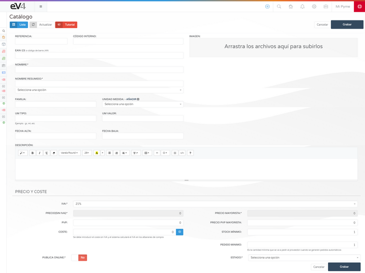
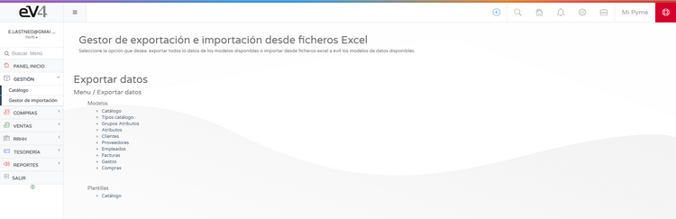
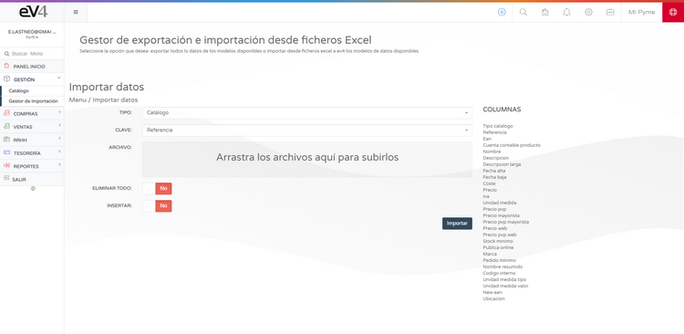

# Gestión de Inventario  

Para poder empezar a vender, primero necesitas tener inventario.  

## Creación manual de artículos  

Puedes crear artículos para tu inventario de manera manual desde la sección:  
**GESTIÓN → CATÁLOGO**.  

1. Pulsamos sobre el botón **NUEVO**.  
2. Se abrirá la **ficha de producto** para completar los datos.  

## Importación y exportación del catálogo  

También podemos **importar/exportar** el catálogo desde ficheros **Excel** con nuestro **GESTOR DE IMPORTACIÓN**.  

- Recomendamos utilizar la **plantilla** proporcionada para un mayor control de los datos a importar.  
- Puedes **exportar** tu catálogo en su totalidad o solo parcialmente.  

## Gestión de ventas  

Cuando hayas **creado o importado** tus productos, podrás empezar a **crear y gestionar pedidos, albaranes y ventas**.  

