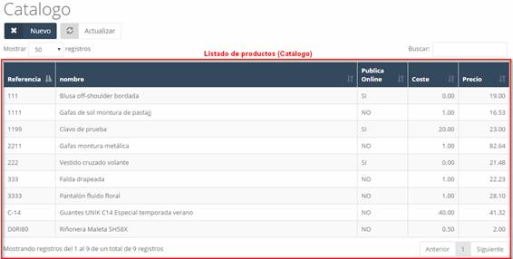
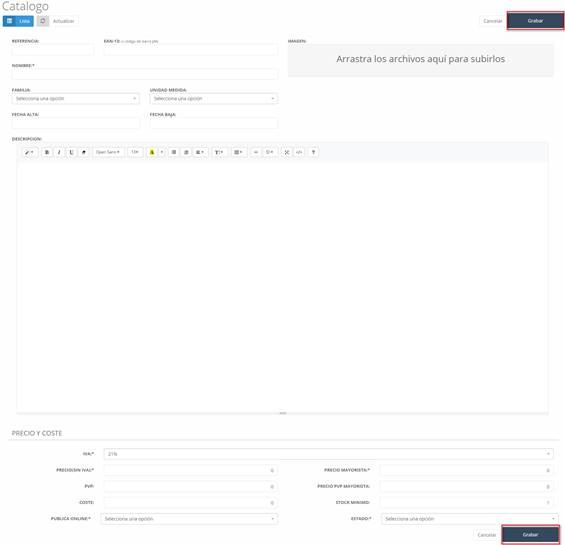
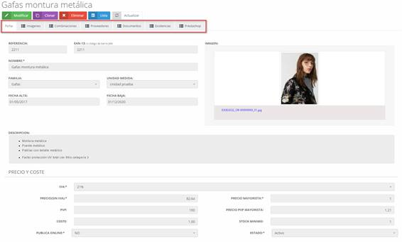
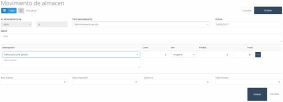

# Stock

Al acceder al **Catálogo**, en la pantalla principal encontraremos el listado con los productos introducidos en el sistema. Inicialmente, este estará vacío.  

📌 *Ver Imagen 181: Almacén – Catálogo*  

---

## 8.2.1 Stock - Nuevo (producto)  

Para añadir un nuevo producto al catálogo:  

1. Pulsar el botón **Nuevo** en la pantalla inicial del catálogo.  
2. Se abrirá un formulario para completar la información del producto.  

📌 *Ver Imagen 182: Almacén - Catálogo – Nuevo*  

### Datos a completar:  
- **Referencia:** Código identificador del producto.  
- **EAN-13:** Código de barras.  
- **Nombre:** Nombre del artículo o producto.  
- **Nombre resumido:** Nombre abreviado del producto.  
- **Imagen:** Imagen del producto.  
- **Marca:** Marca del producto.  
- **Familia:** Categoría o familia del producto.  
- **Unidad de medida:** Forma de medir el producto (unidad, cm, etc.).  
- **Fecha alta:** Fecha desde la cual el producto estará disponible.  
- **Fecha baja:** Fecha a partir de la cual el producto dejará de estar disponible.  
- **Descripción:** Información detallada del producto.  
- **IVA:** Impuesto aplicado al producto.  
- **Precio (sin IVA):** Precio sin impuestos.  
- **PVP:** Precio de venta al público.  
- **Coste:** Costo del producto.  
- **Publica Online:** Indica si el artículo será visible en la tienda online (Prestashop).  
- **Precio mayorista:** Precio de venta a mayoristas.  
- **Precio PVP mayorista:** Precio de venta al público para mayoristas.  
- **Stock mínimo:** Cantidad mínima antes de considerar el producto agotado.  
- **Estado:** Estado actual del producto.  

Una vez completado el formulario, pulsar **Grabar** para almacenar el producto en el sistema.  

📌 *Ver Imagen 183: Almacén - Catálogo – Modificar*  

---

## 8.2.2 Stock – Modificar (Pestañas)  

Para modificar un producto existente:  

1. Hacer clic sobre el producto a modificar en el **Catálogo**.  
2. Se abrirá una nueva pantalla con pestañas asociadas al producto.  
3. Pulsar el botón **Modificar**, realizar los cambios y luego pulsar **Grabar**.  

📌 *Ver Imagen 184: Almacén - Movimientos – Listado de movimientos*  

### Pestañas disponibles:  
- **Ficha:** Información principal del producto.  
- **Imágenes:** Permite añadir imágenes al producto.  
- **Combinaciones:** Configuración de productos por atributos.  
- **Proveedores:** Gestión de proveedores asociados al producto.  
- **Documentos:** Documentos adjuntos al producto.  
- **Existencias:** Stock actual, stock mínimo y cantidad bajo pedido.  
- **Prestashop:** Sincronización del producto con Prestashop.  

📌 *Ver Imagen 185: Almacén - Movimiento – Nuevo*  

---

# 8.3 Movimientos  

En este apartado se encuentran los movimientos del almacén, como entradas y salidas de artículos.  

📌 *Ver Imagen 81: Almacén - Movimientos - Listado de movimientos*  

Los movimientos pueden filtrarse por fechas o productos.  

## 8.3.1 Movimientos – Nuevo  

Para crear un nuevo movimiento:  

1. Pulsar el botón **Nuevo** en la pantalla de movimientos.  
2. Se abrirá un formulario para completar los datos del movimiento.  

📌 *Ver Imagen 82: Almacén - Movimiento - Nuevo*  

### Datos a completar:  
- **Nº movimiento:** Identificador del movimiento (se desbloquea pulsando el candado).  
- **Tipo movimiento:** Clasificación del movimiento.  
- **Fecha:** Fecha de realización del movimiento.  
- **Nota:** Información adicional sobre el movimiento.  
- **Descripción:** Producto y detalles.  
- **Cant:** Cantidad de productos.  
- **IVA:** Impuesto aplicado.  
- **P. Base:** Precio base del producto.  
- **Total:** Precio total según la cantidad.  
- **Botón añadir:** Agregar una nueva línea de producto.  
- **Base exenta:** Precio base exento de IVA.  
- **Base imponible:** Importe gravable.  
- **Cuota IVA:** Impuesto calculado.  
- **Total factura:** Total de la factura.  

Una vez completados los datos, pulsar **Grabar** para guardar el movimiento en el sistema.  
