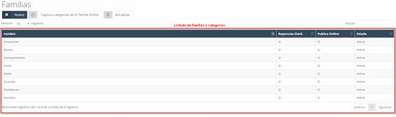
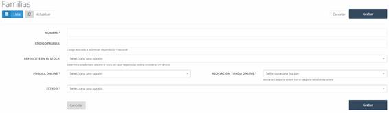
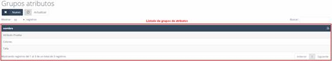
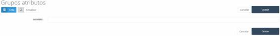
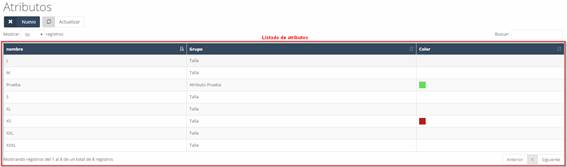
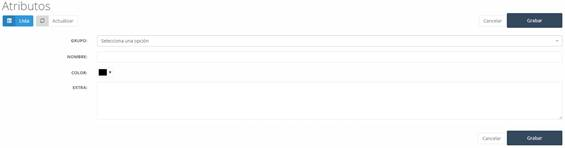
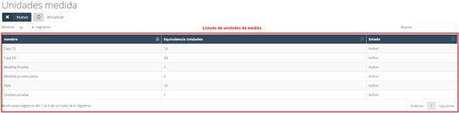

# Familias  

En **Familias**, encontramos las categorías en las que pueden agruparse los productos del catálogo.  

📌 *Ver Imagen 221: Almacén - Familias – Listado*  

---

## 8.10.1 Familias – Nuevo  

Para crear una nueva familia:  

1. Pulsar el botón **Nuevo** en la pantalla inicial de **Familias**.  
2. Se abrirá un formulario para completar la información.  

📌 *Ver Imagen 222: Almacén - Familias – Nuevo*  

### Datos a completar:  
- **Nombre:** Nombre de la familia o categoría.  
- **Código familia:** Identificador de la familia.  
- **Repercute en el stock:** Indica si afecta al stock del catálogo.  
  - *Si es "No", se considera un servicio.*  
- **Código postal:** Código postal del almacén o centro.  
- **Publica online:**  
  - *Si es "Sí", los productos serán visibles online.*  
  - *Si es "No", los productos de esta familia no estarán visibles.*  
- **Asociación tienda online:** Asigna la familia a una categoría de **Prestashop**.  
- **Estado:** Estado de la familia o categoría.  

Una vez completados los datos, pulsar **Grabar** para guardar la nueva familia en el sistema.  

---

# 8.11 Grupos Atributos  

En **Grupos Atributos**, encontramos los grupos que permiten asociar atributos a los productos del sistema.  

📌 *Ver Imagen 223: Almacén - Grupos de Atributos – Listado*  

## 8.11.1 Grupos Atributos – Nuevo  

Para crear un nuevo grupo de atributos:  

1. Pulsar el botón **Nuevo** en la pantalla de **Grupos Atributos**.  
2. Se abrirá un formulario para completar la información.  

📌 *Ver Imagen 224: Almacén - Grupos de Atributos – Nuevo*  

### Datos a completar:  
- **Nombre:** Nombre del grupo de atributos.  

Una vez completado el campo, pulsar **Grabar** para registrar el grupo en el sistema.  

---

# 8.12 Atributos  

En **Atributos**, encontramos los atributos que se asignarán a los productos del catálogo, como **tallas**, **colores**, etc.  

📌 *Ver Imagen 225: Almacén - Atributos – Listado*  

## 8.12.1 Atributos – Nuevo  

Para crear un nuevo atributo:  

1. Pulsar el botón **Nuevo** en la pantalla de **Atributos**.  
2. Se abrirá un formulario para completar la información.  

📌 *Ver Imagen 226: Almacén - Atributos – Nuevo*  

### Datos a completar:  
- **Grupo:** Grupo de atributo al que pertenece el nuevo atributo.  
- **Nombre:** Nombre del atributo.  
- **Color:** Color asignado al atributo.  
- **Extra:** Información adicional del atributo.  

Una vez completados los datos, pulsar **Grabar** para registrar el atributo en el sistema.  

---

# 8.13 Unidades de Medida  

En **Unidades de Medida**, encontramos las unidades aplicables a los productos del catálogo.  

 

📌 *Ver Imagen 227: Almacén - Unidades de medida – Listado*  
