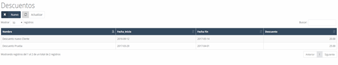

# Bancos  

En este apartado encontramos la **lista de los distintos bancos** con los que la empresa trabaja, ya sea para la **gestión de cuentas** u otras operaciones necesarias.  

---

## **Bancos – Nuevo**  

Podemos **agregar un nuevo banco** al listado pulsando el botón **"Nuevo"** y rellenando el formulario correspondiente, que contiene los siguientes campos:  

- **Cuenta:** Número de la cuenta bancaria.  
- **Entidad:** Código de la entidad bancaria.  
- **Oficina:** Código de la oficina.  
- **DC:** Número de cuenta.  
- **Nombre:** Nombre del banco.  
- **Dirección:** Dirección de la sucursal.  
- **Teléfonos:** Teléfono de contacto del banco.  
- **Contacto:** Nombre de la persona de contacto.  
- **Código estado:** Estado del banco en el sistema.  
- **Nota:** Nota informativa sobre el banco.  
- **IBAN:** IBAN del banco introducido.  

 

---

# **Descuentos**  

Al acceder a la sección de **descuentos**, veremos un listado con todos los descuentos existentes en el sistema. 
Cada cliente puede tener **descuentos asociados** y estos pueden incluir un **rango de fechas** de validez para su aplicación en **productos o catálogos específicos**.  

