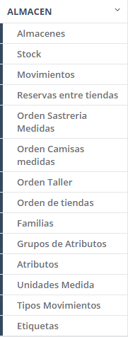
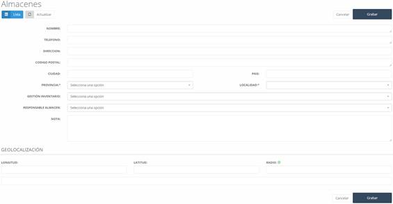

# ALMACÉN  

En este apartado del sistema, encontramos las **funcionalidades asociadas a almacenes**, como el **catálogo, movimientos y familias**, entre otros.  

   

---

## **8.1 Almacenes**  

Aquí se pueden consultar los **diferentes almacenes** disponibles en el sistema. 

  

---

## **8.1.1 Almacenes – Nuevo**  

Para **crear un nuevo almacén o centro**, debemos pulsar el botón **"Nuevo"** en la pantalla inicial de almacenes.  

Al hacerlo, se abrirá un formulario para completar con la información del almacén.  

  

### **Campos a completar:**  
- **Nombre:** Nombre del almacén o centro.  
- **Teléfono:** Teléfono del almacén o centro.  
- **Dirección:** Dirección del almacén o centro.  
- **Código postal:** Código postal de la localidad.  
- **Ciudad:** Ciudad en la que está ubicado.  
- **País:** País en el que se encuentra.  
- **Provincia:** Provincia en la que está ubicado.  
- **Localidad:** Localidad donde se encuentra el almacén.  
- **Gestión Inventario:** Método utilizado para gestionar el inventario.  
- **Responsable almacén:** Persona encargada del almacén.  
- **Nota:** Información adicional sobre el almacén o centro.  
- **Geolocalización:** Coordenadas geográficas del almacén.  

Una vez completados estos campos, debemos pulsar el botón **"Grabar"** para guardar la información en el sistema.   
