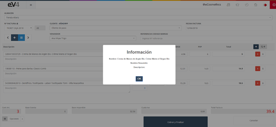
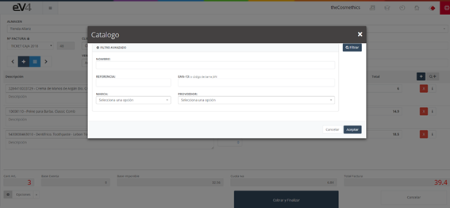
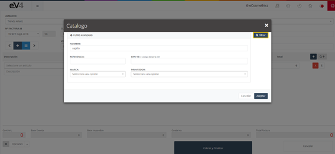

# **Gestión del TPV en eV4 ERP**  

El **TPV** es la herramienta para gestionar las **ventas dentro del local** de la empresa, facilitando la interacción con el cliente de manera **rápida y sencilla**.  

Al acceder al TPV, se muestra un listado de todas las **facturas realizadas**, ya sea de manera manual desde el apartado de ventas o desde el propio TPV, además de un filtro para facilitar la **búsqueda**.

---

## **Vista Inicial de TPV**  

La vista inicial de la sección **TPV** muestra los campos de búsqueda **vacíos** por defecto. Al realizar una búsqueda, los campos conservarán los valores introducidos, facilitando la repetición de búsquedas. Para **restablecer** la plantilla y borrar los datos de la última búsqueda, simplemente pulsa el botón **“Reinicializar”**.

---

## **TPV Nuevo**  

El panel del **TPV Nuevo** tiene una distribución **amigable**, similar al apartado de ventas pero más orientada a la facilidad de uso. 

- Para acceder a la vista **completa**, dirígete al botón desplegable **“Opciones”** en la parte inferior derecha y selecciona **"Más Info"**.

---

### **Botones Principales en el TPV Nuevo**  

1. **Botón TPV NUEVO (+):**  
   - **Ubicación:** Parte superior izquierda, debajo del campo **“Nº FACTURA”**.  
   - **Función:** Genera un **nuevo ticket**, borrando todos los campos y devolviéndolos a su estado inicial.

2. **Botón Lista:**  
   - **Ubicación:** Junto al botón **TPV NUEVO**.  
   - **Función:** Vuelve a la sección inicial de **“TPV”**.

3. **Botones Avance/Retroceso:**  
   - **Ubicación:** A la izquierda y derecha de los botones anteriores.  
   - **Función:** Permite cargar el **ticket anterior** o **posterior**.

4. **Botón Añadir Artículo:**  
   - **Ubicación:** Parte superior derecha, con el símbolo **+**.  
   - **Función:** **Añadir una línea** de producto al ticket.

5. **Botón Eliminar (x):**  
   - **Ubicación:** Botón rojo con una **X**.  
   - **Función:** Elimina una línea de producto del ticket o factura.

6. **Botón Info (i):**  
   - **Ubicación:** Botón blanco con la letra **i**.  
   - **Función:** Muestra información adicional sobre el producto en esa línea.

7. **Botón Consultar Catálogo (Q+):**  
   - **Ubicación:** A la derecha del botón **Añadir Artículo**.  
   - **Función:** Permite buscar un artículo en el catálogo por diversos criterios como **nombre, referencia, EAN-13, marca, proveedor**.  

---

## **Búsquedas Avanzadas**  

Puedes realizar búsquedas precisas utilizando los siguientes criterios:

1. **Nombre:**  
   - Escribe el nombre del artículo y pulsa **"Filtrar"**.

   

   

   - Haz doble clic para añadirlo al ticket.

2. **Referencia:**  
   - Escribe la referencia del artículo y pulsa **"Filtrar"**.

   

   
   - Haz doble clic para añadirlo al ticket.

3. **EAN-13 (Código de barras):**  
   - Igual que la referencia, busca mediante el código de barras.

4. **Marca:**  
   - Filtra por marca seleccionando una del desplegable y pulsando **"Filtrar"**.

5. **Proveedor:**  
   - Filtra por proveedor, escribiendo el nombre o seleccionándolo del listado.

---

## **Campos Principales en TPV**  

- **Nº Factura:** Selecciona la **serie** a la que pertenecerá la factura.  
- **Cliente – Añadir+:** Selecciona el **cliente** para quien se emitirá la factura.  
- **Fecha Factura:** Fija la **fecha** de la factura.  
- **Tipo Vencimiento:** Selecciona el tipo de vencimiento (**efectivo, 30, 60, 90 días**).  
- **Fecha Vencimiento:** Fija la **fecha de vencimiento** de la factura.  
- **Vendedor:** Selecciona el **vendedor** asignado a la venta.  
- **Referencia Código Barras:** Permite **leer el código de barras** o escribirlo manualmente.  
- **Artículo:** Una línea para cada artículo incluido en la factura.

---

## **Opciones Disponibles en TPV**  

1. **Promociones:**  
   - Permite seleccionar una **promoción vigente** para aplicar al ticket.

2. **Más Info:**  
   - Cambia entre la vista **simplificada** y **completa** del TPV.

3. **Descuento:**  
   - Aplica un **descuento** sobre la factura.

4. **Tarjeta Regalo:**  
   - **Carga** una tarjeta regalo a la factura.

5. **Segundo Pago:**  
   - Permite **establecer un segundo pago** para la factura.

6. **Cambio:**  
   - Indica el **cambio** que se debe entregar al cliente.

---
