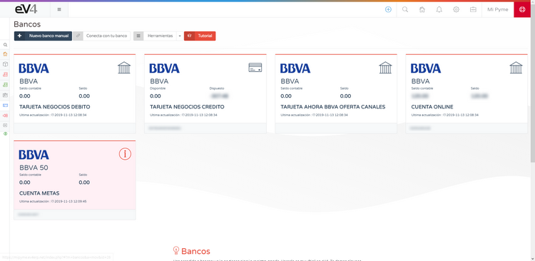
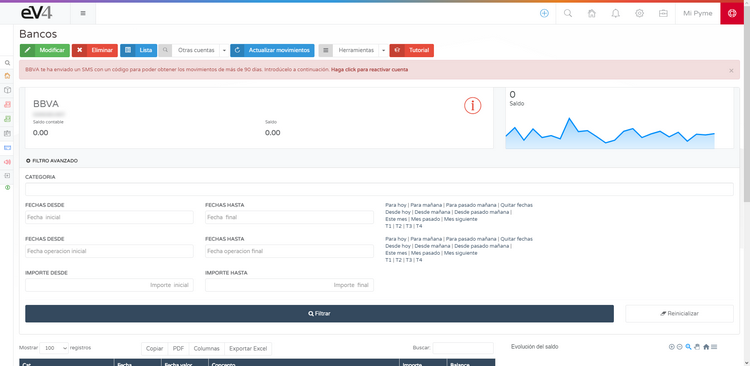

# Conecta con tu Banco

eV4 te permite conectar con tu banco para consultar tus movimientos bancarios. eV4 solo tiene acceso a sus datos bancarios en modo lectura, es decir, solo puede consultar dichos datos. Nunca podrá realizar operaciones financieras (pagos, transferencias, etc).

Esta función se encuentra en el menú **Tesorería → Bancos**.

La primera vez que accedamos veremos la siguiente pantalla:

Pulsamos sobre el botón **Conecta con tu Banco** y veremos la siguiente pantalla donde tendremos que seleccionar nuestra entidad bancaria:

eV4 puede trabajar con más de 100 entidades bancarias de Europa y América. Podemos filtrar las entidades bancarias por países, pulsando sobre él o bien buscarlas directamente por su nombre. Cuando la encontremos, pulsamos sobre ella.

eV4 se adapta a la forma de trabajar de cada banco y te solicitará los datos requeridos por el mismo:

Una vez introducidos los datos requeridos, pulsamos el botón **Conectar**.

La primera vez que eV4 se conecta con su banco, solicita los movimientos del último año. Para solicitar los movimientos de periodos superiores a 90 días, según la normativa europea, su entidad bancaria le ha de facilitar un código de control que debe introducir a continuación:

Pulsamos el botón **Validar** y esperamos a que el proceso termine. Después nos aparecerá en pantalla las cuentas que tengamos en esta entidad bancaria:

Si alguna de las cuentas tiene un símbolo en color rojo de una **i** dentro de un círculo, significa que se requiere que el usuario realice alguna acción. Si pulsamos sobre una cuenta, entramos en ella.

Seguimos las instrucciones, en este caso pulsamos sobre el botón **Haga Click para Reactivar Cuenta**:

Y esperamos a que termine.

Continuar
