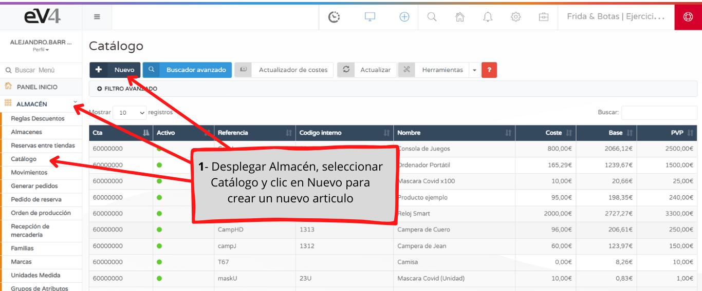
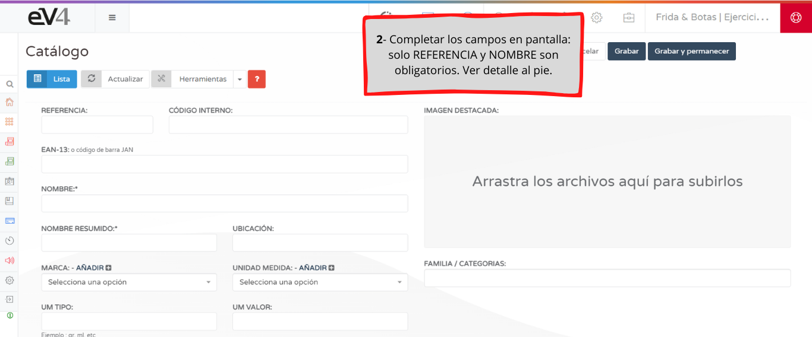
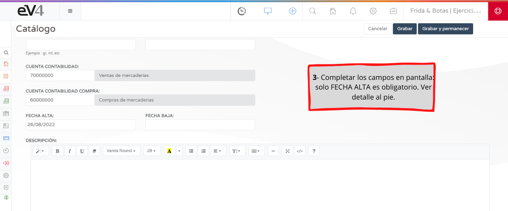

En este tutorial te mostramos como ingresar el alta de un artículo en forma manual. Para conocer el procedimiento de alta masiva de artículos ver "Importar desde Ficheros Excel".

**REFERENCIA**: es obligatoria y única para cada artículo y nunca se debe modificar. Crear la misma de manera que identifique fácilmente al artículo. Por ejemplo AL001.

**CODIGO INTERNO**: también es para identificar al producto, no es obligatorio, y puede utilizarse por ejemplo para la referencia de un proveedor.

**EAN-13**: aquí se introduce el código de barras de un artículo. Se puede hacer manual o mediante lectora, posicionando el cursor en la casilla.

**NOMBRE**: ingresar el nombre del artículo. Es obligatorio y puede modificarse cuando se desee.

**NOMBRE RESUMIDO**: es el nombre abreviado del producto que se mostrará en el tique.

**UBICACIÓN**: ingresar, en caso de corresponder, la ubicación del articulo en el almacén. Por ejemplo: Pasillo 2 Estantería 4

**MARCA**: seleccionar la marca del artículo. La misma debe estar previamente registrada en el sistema. (se puede realizar desde “AÑADIR +”)

**UNIDAD DE MEDIDA**: seleccionar la Unidad de Medida del artículo. La misma debe estar previamente registrada en el sistema. (se puede realizar desde “AÑADIR +”)

**UM VALOR**: ingresar el valor correspondiente. Aplica para la impresión de etiquetas de productos químicos o sus derivados.

**UM TIPO**: ingresar el tipo correspondiente. Aplica para la impresión de etiquetas de productos químicos o sus derivados.

**IMAGEN DESTACADA**: ingresar la imagen del artículo.

**FAMILIA / CATEGORIAS**: seleccionar la o las familias en caso de corresponder. La misma debe estar previamente registrada en el sistema desde el apartado FAMILIAS

**CUENTA CONTABILIDAD / COMPRA**: seleccionar las cuentas contables en caso de haber ingresado un plan contable previamente, o simplemente dejar las cuentas definidas de ev4 por defecto.

**FECHA ALTA**: ingresar la fecha de alta del artículo en ev4.

**FECHA BAJA**: ingresar fecha para descatalogar el artículo.

**DESCRIPCION**: redactar, si se requiere, la descripción del artículo. La misma se trasladará a la tienda on line en caso de corresponder.

**IVA**: seleccionar el IVA que lleva el artículo

**PRECIO SIN IVA**: ingresar el precio sin IVA del artículo. (según la configuración, se calcula automáticamente al ingresar el PVP)

**PVP**: ingresar el precio al público del artículo, con IVA incluido. (según la configuración, se calcula automáticamente al ingresar el PRECIO SIN IVA)

**% BENEF**: ingresar el porcentaje de ganancia por venta del artículo

**MAYORISTA**: igual que PRECIO SIN IVA, PVP y % BENEF pero para los precios Mayoristas. Ev4 permite llevar ambos precios por artículo.

**COSTE**: ingresar el coste del articulo

**STOCK MINIMO**: ingresar la cantidad de stock mínimo que debe tener el articulo

**PEDIDO MINIMO**: ingresar la cantidad mínima que desea para cada pedido a realizar

**PUBLICA ON LINE**: seleccionar SI/NO para habilitar el artículo a la tienda on line

**GESTIONA STOCK**: seleccionar SI/NO para configurar si el artículo ajusta sus movimientos al stock ingresado en el sistema

**ESTADO**: desplegar para seleccionar el estado del artículo.