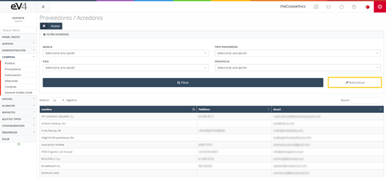
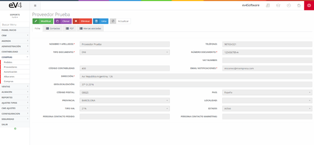

# Proveedores

Listado de los proveedores a los que se les solicitan los productos con los que se comercializa en la empresa.

Imagen 64: Proveedores

Esta es la vista inicial de la sección ***“PROVEEDORES”***, inicialmente los campos de búsqueda están por defecto en blanco. Cuando realicemos una búsqueda, los campos conservarán por defecto los valores introducidos en esta, por si es necesario volver a repetir una búsqueda relacionada con estos datos.

Si queremos restablecer el estado inicial de la plantilla y borrar los datos de la última búsqueda podemos hacerlo pulsando el botón ***“Reinicializar”***.

 

Dentro del contenido de un proveedor, además de los distintos campos para rellenar sobre este, tenemos una serie de pestañas como son los contactos del proveedor, los ficheros PDF o archivos relacionados a este que deseemos guardar.

Imagen 65: Vista proveedores
## 6.2.1        Proveedores – Nuevo

Para añadir un nuevo proveedor debemos pulsar sobre el botón ***“NUEVO”***, lo que nos mostrará el formulario arriba visto en la imagen, pero esta vez para rellenar los campos:

- **Nombre y apellidos**: En el caso de ser una empresa pondremos el nombre, pero en el caso de un particular, el nombre y los apellidos.

- **Teléfono**: Teléfono general de contacto.

- **Tipo de documento**: Tipo de documento (NIF, NIE, DNI, etc.).

- **Número documento**: Número del tipo de documento seleccionado.

- **VAT NUMBER**: Número VAT.

- **Código contabilidad**: Código para tesorería.

- **Email notificaciones**: Correo electrónico del proveedor.

- **Dirección**: Dirección del proveedor.

- **Geolocalización**: Dirección del proveedor en coordenadas.

- **Código postal**: Código postal de la dirección.

- **País**: País en el que se encuentra el proveedor.

- **Provincia**: Provincia en la que se encuentra el proveedor.

- **Localidad**: Localidad en la que se encuentra el proveedor.

- **Tipo IVA**: Tipo de IVA con el que trabaja el proveedor.

- **Estado**: Estado del proveedor.

- **Persona contacto pedido**: Persona de contacto por parte del proveedor.

- **Persona contacto márketing**: Persona de contacto por parte del proveedor, del área de marketing.

Imagen 66: Nuevo proveedor

 