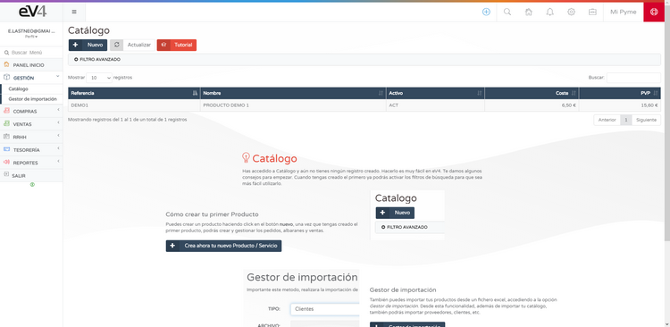

# Creación e Importación de Artículos en el Inventario  

Para poder empezar a vender, primero necesitas tener inventario.  
Puedes crear artículos para tu inventario de manera manual desde la sección:  

**GESTIÓN → CATÁLOGO**  

## Creación Manual de Artículos  

Si pulsamos sobre el botón **NUEVO**, se abrirá la ficha de producto para completar con la información necesaria.  

## Importación y Exportación de Catálogo  

También podemos **importar/exportar** el catálogo desde ficheros Excel utilizando nuestro **GESTOR DE IMPORTACIÓN**.  

**Recomendación:** Se recomienda utilizar la plantilla proporcionada para un mayor control de los datos a importar.  

Cuando hayas creado o importado tus productos, podrás empezar a **crear y gestionar pedidos, albaranes y ventas**.  

## Exportación del Catálogo  

Puedes **exportar** tu catálogo en su totalidad o solo parcialmente, según tus necesidades.  

---

Una vez configurado tu inventario, estarás listo para gestionar tus ventas de manera eficiente. 🚀  

