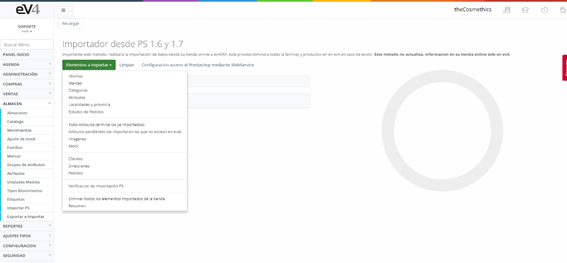
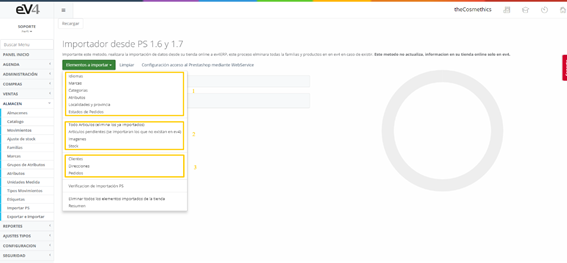

# Importar PS en eV4ERP  

En esta sección podemos importar las bases de datos desde la tienda online a **eV4ERP**.  

---

## Opciones de Importación  

Vemos en el desplegable que disponemos de **5 bloques de opciones**:  

- **Bloque 1:** Idiomas, Marcas, Categorías, Atributos, Localidades y provincias, Estados de pedidos.  
- **Bloque 2:**  
  - Todo Artículos (*elimina los ya importados*).  
  - Artículos pendientes (*se importarán los que no existan en eV4*).  
  - Imágenes.  
  - Stock.  
- **Bloque 3:** Clientes, Direcciones, Pedidos.  
- **Bloque 4:** Verificación de Importación PS.  
- **Bloque 5:**  
  - Eliminar todos los elementos importados de la tienda.  
  - Resumen.  

---

## Procedimiento de Importación  

Para minimizar posibles problemas en la importación, se recomienda realizarla **de forma secuencial y descendente por bloques**.  

### Pasos recomendados:  

1. **Idiomas**  
2. **Marcas**  
3. **Categorías**  
4. **Atributos**  
5. **Localidades y provincias**  
6. **Estados de Pedidos**  
7. **Todo Artículos** (*elimina los ya importados*)  
8. **Artículos pendientes** (*se importan los que no existan en eV4*)  
9. **Imágenes**  
10. **Stock**  
11. **Clientes**  
12. **Direcciones**  
13. **Pedidos**  

---

## Funcionalidades de Importación  

### **Verificación de Importación PS**  
- Compara los registros de la tienda online con los importados a eV4ERP y verifica si coinciden.  

### **Eliminar todos los elementos importados de la tienda**  
- Borra de **eV4ERP** los registros que provienen de la tienda online.  
- **Importante:** Nuestro software **no altera** los registros de la tienda online, solo los copia y trabaja sobre ellos dentro de eV4.  

### **Resumen**  
- Informa del número de registros importados.  

---

## Nota Importante  

Este método **importará datos desde su tienda online a eV4ERP**, eliminando todas las familias y productos previamente importados en **eV4ERP**.  

**Este proceso no actualiza información en su tienda online, solo en eV4ERP.**  
**eV4ERP diferencia entre registros propios (creados dentro del sistema) y los registros importados desde PrestaShop.**  

