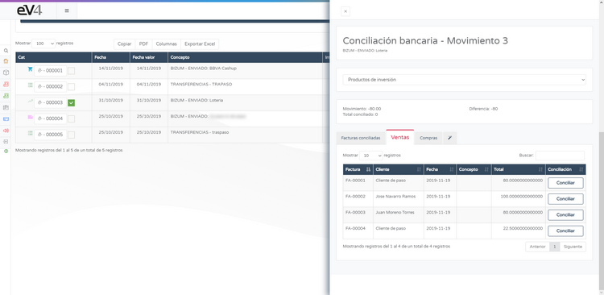

# Conecta con tu Banco en eV4ERP  

eV4 te permite conectar con tu banco para consultar tus movimientos bancarios.  
**eV4 solo tiene acceso a tus datos bancarios en modo lectura**, es decir, solo puede consultar dichos datos.  
**Nunca podrá realizar operaciones financieras** (*pagos, transferencias, etc.*).  

**Ubicación de la función:**  
Menú **TESORERÍA → BANCOS**.  

---

## Conectar con tu Banco  

La primera vez que accedamos veremos la siguiente pantalla.  

1. Pulsamos sobre el botón **CONECTA CON TU BANCO**.  
2. Se mostrará una pantalla donde debemos seleccionar nuestra **entidad bancaria**.

3. eV4 puede trabajar con **más de 100 entidades bancarias** de Europa y América.  
   - Podemos filtrar las entidades bancarias por **país** o buscar directamente por su **nombre**.  
   - Una vez encontrada, pulsamos sobre ella.  

4. eV4 se adapta a la forma de trabajar de cada banco y solicitará los datos requeridos por el mismo.  

5. Introducimos los datos requeridos y pulsamos **CONECTAR**.  

---

## Descarga de Movimientos  

- La primera vez que **eV4** se conecta con tu banco, solicita los movimientos del **último año**.  
- Para solicitar movimientos de periodos superiores a **90 días**, según la normativa europea, tu banco te proporcionará un código de control que deberás introducir. 

- Pulsamos **VALIDAR** y esperamos a que el proceso termine.  
- Aparecerán en pantalla las **cuentas disponibles** en la entidad bancaria.  

---

## Gestión de Cuentas con Errores  

Si alguna cuenta tiene un **símbolo rojo** con una *"i"* dentro de un círculo, significa que requiere acción del usuario.  

1. Pulsamos sobre la cuenta para acceder. 

2. Seguimos las instrucciones y pulsamos **HAGA CLICK PARA REACTIVAR CUENTA**.  

3. Esperamos a que termine el proceso.  

---

## Herramientas Disponibles  

En la parte superior de la pantalla, encontramos el menú **HERRAMIENTAS** con las siguientes opciones:  

- **ACTUALIZAR TODAS LAS CUENTAS** → Actualiza los movimientos de todas las cuentas.  
- **ACTUALIZAR MOVIMIENTOS** → Actualiza los movimientos de la cuenta seleccionada.  
- **CONCILIACIÓN AGRUPADA** → Permite conciliar los movimientos con las facturas.  
- **IMPORTAR NORMA 43** → Importa el archivo de la norma 43 proporcionado por el banco.  

- **ASIGNAR CÓDIGO VALIDACIÓN** → Al reactivar una cuenta, permite introducir el código de verificación.  

También disponemos del menú **OTRAS CUENTAS** para cambiar entre cuentas sin volver a la pantalla de bancos.  

---

## Filtrado de Movimientos  

Una vez descargados los movimientos, podemos filtrar el periodo de tiempo deseado utilizando el **FILTRO AVANZADO**.  

Encima del listado de movimientos encontramos 4 botones:  

- **COPIAR** → Copia al portapapeles todos los movimientos.  
- **PDF** → Genera un documento PDF con los movimientos. 

- **COLUMNAS** → Permite seleccionar qué columnas mostrar en el listado.  

- **EXPORTAR EXCEL** → Genera una hoja de cálculo con los movimientos en formato EXCEL.  

---

# Conciliación Bancaria  

La conciliación bancaria es una parte clave de la **gestión de tesorería** de la empresa.  
Consiste en justificar cada movimiento bancario con su operación correspondiente (*factura, ingreso, egreso, etc.*).  

### **Cómo conciliar un movimiento con una factura**  

1. **Seleccionamos un movimiento**, marcando la casilla a la derecha del número.  
2. Vamos al menú **HERRAMIENTAS** y seleccionamos **CONCILIACIÓN AGRUPADA**.  

- Si no seleccionamos un movimiento, el sistema mostrará un mensaje de error.  

3. Se abrirá una pantalla con diferentes categorías de movimientos.  

**Clasificación de movimientos por pestañas:**  

- **FACTURAS CONCILIADAS** → Facturas ya conciliadas con este movimiento.  
- **VENTAS** → Facturas de venta disponibles en el sistema.  
- **COMPRAS** → Facturas de compra disponibles en el sistema.  
- **ASISTENTE** → Facturas sugeridas por el sistema como relacionadas con el movimiento.  

### **Conciliar un movimiento**  

1. Seleccionamos la factura adecuada (*venta, compra o sugerida*).  
2. Pulsamos el botón **CONCILIAR**.  

3. La factura aparecerá en la pestaña **FACTURAS CONCILIADAS**.  
4. Si queremos liberar la factura, pulsamos **DESCONCILIAR**.  

---

## Gráficos Interactivos  

En la parte derecha de la pantalla encontramos gráficas interactivas:  

- **Gráfica de barras** → Podemos activar/desactivar **INGRESOS, EGRESOS y SALDO** pulsando sobre sus nombres.  
- **Gráfica circular** → Cada categoría de movimiento tiene un color.  
- Pulsando sobre una sección filtraremos los movimientos de esa categoría.  
- Para volver al listado completo, pulsamos sobre la leyenda de categorías.  

---

# Nota Importante  

- **Este método importará los datos de tu tienda online a eV4ERP.**  
- **Este proceso eliminará todas las familias y productos en eV4 si han sido importados previamente.**  
- **Este método NO actualiza información en tu tienda online, solo en eV4ERP.**  
- **eV4ERP diferencia entre registros propios (generados en eV4) y registros importados desde PrestaShop.**  
