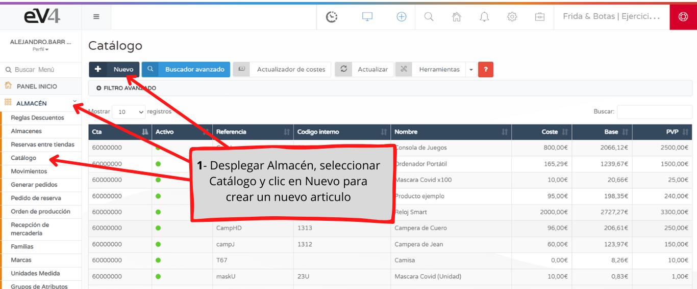
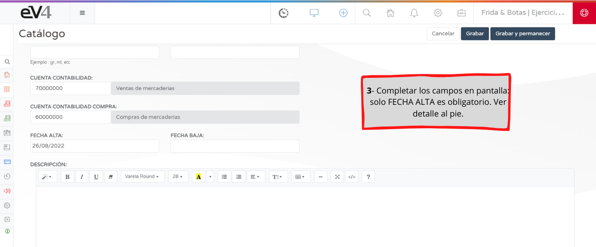
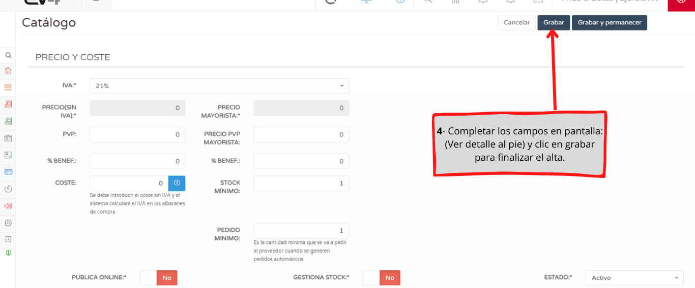

# Tutorial: Alta Manual de un Artículo

En este tutorial te mostramos cómo ingresar el alta de un artículo en forma manual.  
Para conocer el procedimiento de alta masiva de artículos, ver **"Importar desde Ficheros Excel"**.

---

## Campos A Tener en Cuenta

#### REFERENCIA  
- Es obligatoria y única para cada artículo y nunca se debe modificar.  
- Crear la misma de manera que identifique fácilmente al artículo.  
- **Ejemplo:** `AL001`.

#### CÓDIGO INTERNO  
- También es para identificar al producto, no es obligatorio.  
- Puede utilizarse, por ejemplo, para la referencia de un proveedor.

#### EAN-13  
- Introducir el código de barras del artículo.  
- Puede ingresarse manualmente o mediante lectora, posicionando el cursor en la casilla.

#### NOMBRE  
- Ingresar el nombre del artículo.  
- Es obligatorio y puede modificarse cuando se desee.

#### NOMBRE RESUMIDO  
- Nombre abreviado del producto que se mostrará en el tique.

#### UBICACIÓN  
- Ingresar, en caso de corresponder, la ubicación del artículo en el almacén.  
- **Ejemplo:** `Pasillo 2 Estantería 4`.

#### MARCA  
- Seleccionar la marca del artículo.  
- Debe estar previamente registrada en el sistema. *(Se puede realizar desde "AÑADIR +")*.

#### UNIDAD DE MEDIDA  
- Seleccionar la Unidad de Medida del artículo.  
- Debe estar previamente registrada en el sistema. *(Se puede realizar desde "AÑADIR +")*.

#### UN VALOR  
- Ingresar el valor correspondiente.  
- Aplica para la impresión de etiquetas de productos químicos o sus derivados.

#### UN TIPO  
- Ingresar el tipo correspondiente.  
- Aplica para la impresión de etiquetas de productos químicos o sus derivados.

#### IMAGEN DESTACADA  
- Ingresar la imagen del artículo.

#### FAMILIA / CATEGORÍAS  
- Seleccionar la o las familias en caso de corresponder.  
- Debe estar previamente registrada en el sistema desde el apartado **FAMILIAS**.

---

## Datos Contables y de Gestión

#### CUENTA CONTABILIDAD / COMPRA  
- Seleccionar las cuentas contables en caso de haber ingresado un plan contable previamente.  
- O bien, dejar las cuentas definidas de **ev4** por defecto.

#### FECHA ALTA  
- Ingresar la fecha de alta del artículo en **ev4**.

#### FECHA BAJA  
- Ingresar la fecha para descatalogar el artículo.

#### DESCRIPCIÓN  
- Redactar, si se

## Precios y Facturación

#### IVA  
- Seleccionar el IVA correspondiente al artículo.

#### PRECIO SIN IVA  
- Ingresar el precio sin IVA del artículo. *(Según la configuración, se calcula automáticamente al ingresar el PVP).*

#### PVP  
- Ingresar el precio al público del artículo, con IVA incluido. *(Según la configuración, se calcula automáticamente al ingresar el PRECIO SIN IVA).*

#### % BENEF  
- Ingresar el porcentaje de ganancia por venta del artículo.

#### MAYORISTA  
- Igual que **PRECIO SIN IVA**, **PVP** y **% BENEF**, pero para los precios mayoristas.  
- **ev4** permite llevar ambos precios por artículo.

#### COSTE  
- Ingresar el coste del artículo.

---

## Control de Stock y Publicación

#### STOCK MÍNIMO  
- Ingresar la cantidad de stock mínimo que debe tener el artículo.

#### PEDIDO MÍNIMO  
- Ingresar la cantidad mínima deseada para cada pedido a realizar.

#### PUBLICA ONLINE  
- Seleccionar **SI/NO** para habilitar el artículo en la tienda online.

#### GESTIONA STOCK  
- Seleccionar **SI/NO** para configurar si el artículo ajusta sus movimientos al stock ingresado en el sistema.

#### ESTADO  
- Desplegar para seleccionar el estado del artículo.