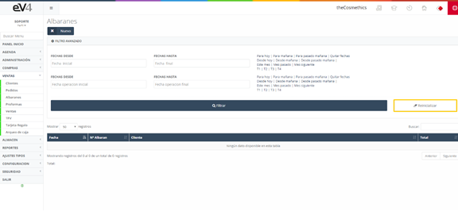
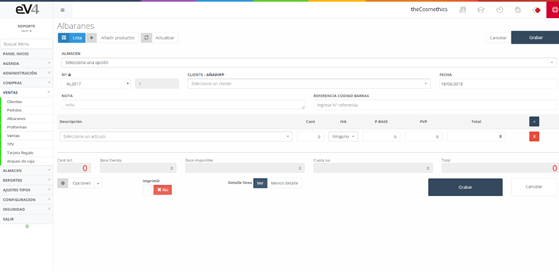
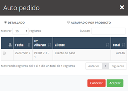
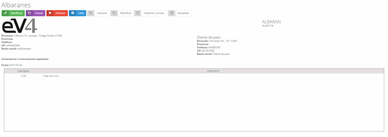

# Albaranes

Los albaranes son generados a partir de los pedidos de ventas realizados, pero también se pueden crear albaranes sin necesidad del paso previo si fuera necesario.

En la pantalla inicial, encontramos un listado de todos los albaranes existentes, además de un pequeño filtro para su búsqueda.

---

## Vista Inicial
 

Esta es la vista inicial de la sección **"ALBARANES VENTA"**.  
Inicialmente, los campos de búsqueda están por defecto en blanco.  
Cuando realicemos una búsqueda, los campos conservarán los valores introducidos, por si es necesario volver a repetir una búsqueda relacionada con estos datos.

Si queremos restablecer el estado inicial de la plantilla y borrar los datos de la última búsqueda, podemos hacerlo pulsando el botón **"Reinicializar"**.

---

## Creación de un Nuevo Albarán

Para crear un nuevo albarán, podemos hacerlo:  
1. Desde un **pedido de ventas**, como explicado anteriormente.  
2. Creando uno **nuevo**, completando los campos del formulario con la diferencia de que introduciremos un **cliente** y no un proveedor.

 

En el formulario de **nuevo albarán**, encontramos un botón **"Pedidos"**.  
Al pulsarlo, aparecerá una ventana emergente con los **pedidos del cliente seleccionado** en el formulario.  

- Seleccionamos los pedidos que deseamos importar y pulsamos **Aceptar**.  
- Se importarán automáticamente **todas las líneas** de los pedidos seleccionados en nuestro albarán.

  

---

## Funcionalidades del Albarán

Una vez generado un albarán, tendremos los mismos botones que en un **albarán de compra**, como los de **rectificar e imprimir**.  
Sin embargo, en este caso, dispondremos de un nuevo botón:  

### **Facturar**  
- Nos permite **crear la factura** del albarán para el cliente.

### **Aplicar Descuentos**  
- Del mismo modo que en los pedidos, podemos aplicar descuentos desde el menú desplegable **"Opciones"**.  
- Se introduce un **porcentaje de descuento** en la ventana emergente.

