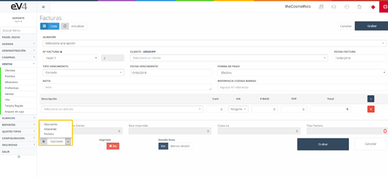

# Ventas

Las ventas se generan cuando los clientes compran productos de nuestra empresa.  
Al ingresar por primera vez, vemos un listado de todas las ventas generadas, además de un pequeño filtro para su búsqueda.

---

## Vista Inicial 

Esta es la vista inicial de la sección **"FACTURAS"**.  
Inicialmente, los campos de búsqueda están en blanco.  
Cuando realicemos una búsqueda, los campos conservarán los valores introducidos, por si es necesario volver a repetir una búsqueda relacionada con estos datos.

Si queremos restablecer el estado inicial de la plantilla y borrar los datos de la última búsqueda, podemos hacerlo pulsando el botón **"Reinicializar"**.

---

## Creación de una Nueva Factura  

Para crear una nueva venta: 

1. Seleccionamos el **ALMACÉN**.  
2. Indicamos la serie de la factura en el campo **"Nº FACTURA"**.  
3. Elegimos el **CLIENTE** al que se le emite la factura.  
4. Asignamos la **FECHA FACTURA**.  

El campo **"TIPO DE VENCIMIENTO"** permite seleccionar:  
- **Al contado**,  
- **A 30, 60 o 90 días**.

---  

El campo **"FECHA DE VENCIMIENTO"** permite asignar la fecha en la que debe pagarse la factura.  

En la imagen también observamos el campo **"FORMA DE PAGO"**.  
Al pulsarlo, podemos seleccionar el método de pago de la factura.

---

### Agregando Productos 

Para introducir productos en la factura rápidamente:  
- Podemos escanear el **código de barras** del producto mediante un lector.  
- Esto traerá automáticamente el producto con sus datos.  
- También podemos pulsar el botón **"DETALLE LÍNEA"** para añadir información adicional al producto.

Para **imprimir** y **enviar** la factura, seguimos el mismo proceso que en apartados anteriores.

---

## Importar Albaranes a una Factura  

En el formulario de **nueva VENTA/FACTURA**, encontramos un botón **"Albaranes"** dentro del menú desplegable **"Opciones"**.

 

Al pulsarlo, aparece una ventana emergente con los **albaranes del cliente seleccionado** en el formulario.  

- Seleccionamos los albaranes que deseamos importar y pulsamos **Aceptar**.  
- Se importan automáticamente **todas las líneas** de los albaranes seleccionados en la factura.

---

## Funcionalidades Adicionales

### Aplicar Descuentos  
Desde el menú desplegable **"Opciones"**, podemos aplicar descuentos.  
Al pulsar la opción, aparecerá una ventana emergente donde ingresamos el **porcentaje de descuento**, que se aplicará al precio total.

### Acceder a la Agenda  
Existe la posibilidad de acceder a la **agenda** desde la pantalla de **nueva factura**.  
Esto nos permite **concertar una cita** con el cliente directamente.

---

## Cobrar una Factura

Una vez generada la factura, la vista mostrará un nuevo botón **"Cobrar factura"**.

Para **cobrar la factura**, pulsamos el botón y se desplegará una ventana como la siguiente:

  

En la ventana **"Cobrar factura"**, encontramos dos pestañas:  
1. **Cobro:** Aquí introducimos los datos de la **forma de pago** del cliente.  
2. **Movimientos:** Muestra un listado de los **pagos realizados** sobre esa factura.
