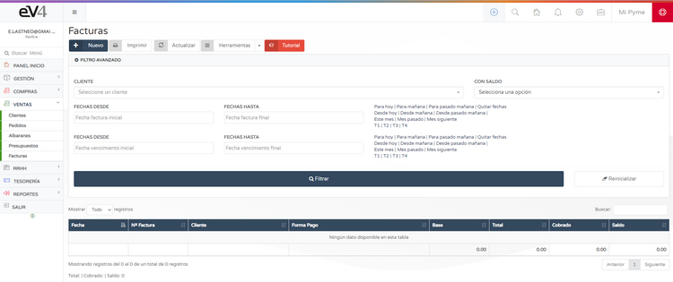

# Creación de Facturas  

Hemos realizado la primera venta, ahora procederemos a generar la primera factura.  

---

##  Métodos para crear una factura  

###  Método rápido  
1. Pulsar el botón **AÑADIR** (botón azul en la barra superior derecha).  
2. Pulsar el botón **NUEVA FACTURA**. 

###  Método desde el menú  
1. Acceder a **VENTAS → FACTURAS**.  

2. Pulsar el botón **NUEVO** para crear una nueva factura.  

---

##  Creación de una factura  

Al crear una factura, se cargará una pantalla donde podremos completar la información necesaria:  

### Datos básicos de la factura  
- **Serie**: Seleccionar la serie a la que pertenece la factura.  
- **Cliente**: Debe estar registrado en la base de datos.  
- **Fecha**: Por defecto, se asigna la fecha actual.  
- **Vencimiento**: Se puede establecer el tipo de vencimiento, la fecha y la forma de pago.  

### Añadir productos a la factura  

####  Opción 1: Usar código de barras  
1. Pulsar sobre el campo **REFERENCIA CÓDIGO DE BARRAS**.  
2. Cuando el campo se ponga azul, escribir manualmente la referencia o utilizar un escáner de códigos de barras.  

####  Opción 2: Buscar producto por nombre  
1. Pulsar sobre el campo **SELECCIONE UN ARTÍCULO**.  
2. Se abrirá un buscador donde podremos escribir el nombre del producto.  
3. Aparecerán las coincidencias disponibles para seleccionar el producto.  

### Gestionar líneas de la factura  
- **Añadir una línea**: Pulsar el botón **+ NUEVA LÍNEA** (ubicado en el centro de la pantalla o en el botón azul con el símbolo **+** a la izquierda).  
- **Eliminar una línea**: Pulsar el botón **rojo con una X** en su interior.  

### Guardar la factura  
Una vez completados todos los datos, pulsar el botón **GRABAR** para almacenar la factura en el sistema.  

 **Nota:** Las facturas **NO descuentan stock**.  
