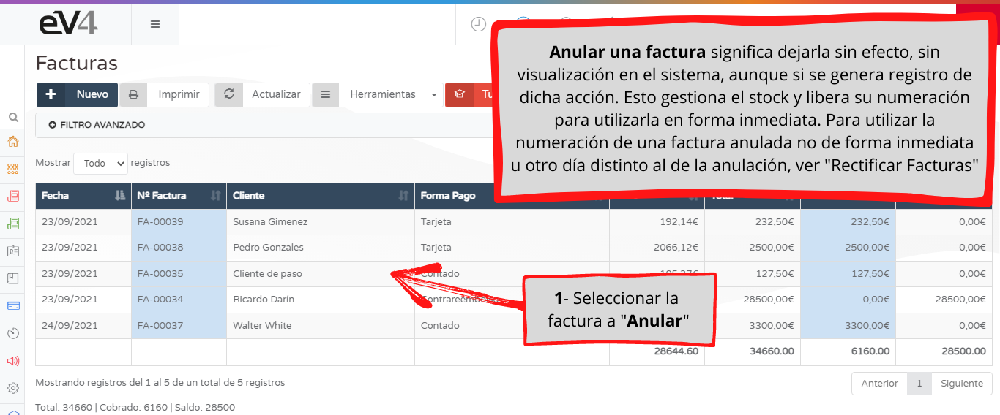
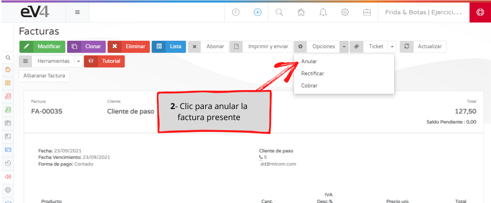
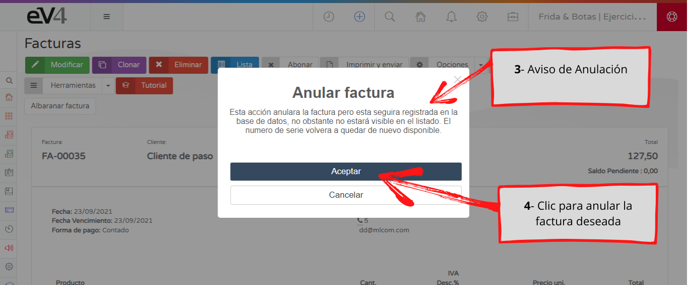
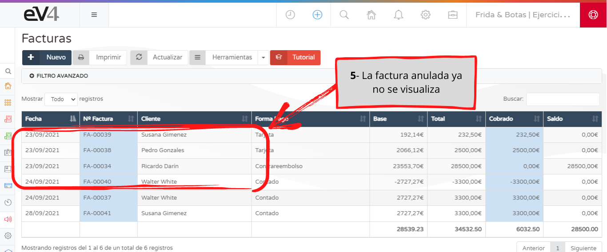
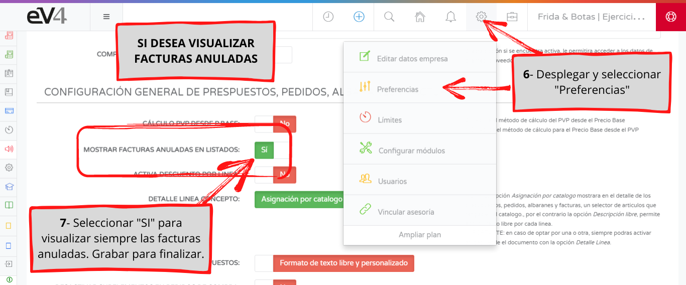
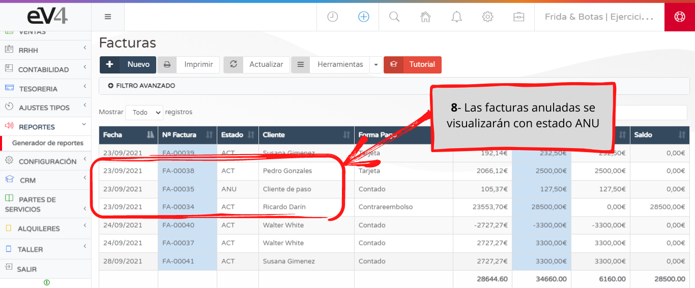

Anular una factura significa dejarla sin efecto, sin visualización en el sistema, aunque sí queda registrada la acción en ev4. Esto gestiona el stock y libera su numeración para utlizarla de forma inmediata. Para utilizar la numeración de una factura anulada de forma inmediata u otro día distinto al de la anulación, ver "Rectificar Facturas".

