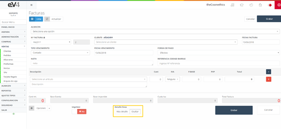
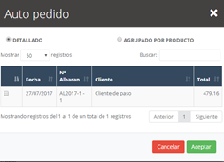

Son las ventas generadas a la hora de la compra de los productos de nuestra empresa. Al entrar por primera vez, vemos el listado de todas las ventas generadas, además de un pequeño filtro para la búsqueda de estas.

[Convertir albarán en factura - Watch Video](https://www.loom.com/share/e24f4bf2bcd0410fb5f2f6569a1293ea)

Imagen 110: Ventas

Esta es la vista inicial de la sección “FACTURAS”, inicialmente los campos de búsqueda están por defecto en blanco. Cuando realicemos una búsqueda, los campos conservarán los valores introducidos en esta, por si es necesario volver a repetir una búsqueda relacionada con estos datos.

Si queremos restablecer el estado inicial de la plantilla y borrar los datos de la última búsqueda podemos hacerlo pulsando el botón “Reinicializar”.

## Facturas Nuevo

Vista inicial de la plantilla “FACTURAS”.

Imagen 111: Nueva Factura 1

Para crear una nueva venta seleccionamos el **ALMACÉN**, la serie de la factura en el campo “**Nº FACTURA**”, el **CLIENTE** al que se la realizamos, además de la **fecha de emisión de la factura** en el campo “**FECHA FACTURA**”.

El campo “**TIPO DE VENCIMIENTO**” nos permite seleccionar el tipo de vencimiento, al contado, o a 30, 60 o 90 días.

Imagen 112: Nueva Factura 3

El campo “**FECHA DE VENCIMIENTO**” nos permite asignar la fecha de vencimiento de la factura.

En la foto observamos el campo “**FORMA DE PAGO**”, que pulsar sobre él nos permite seleccionar el método de pago de la factura.

Imagen 113: Nueva Factura 4

Para introducir el catálogo de una manera más rápida podemos hacerlo ingresando el código de barras del producto mediante un lector de código de barras, esto nos traerá el producto y sus datos. Además, si pulsamos sobre el botón “**DETALLE LÍNEA**” nos dará la opción de introducir algún detalle más al producto.

Para imprimir la factura y enviarla el proceso a realizar es el mismo que el seguido en los apartados anteriores.

Imagen 114: Nueva Factura 5

En el formulario de nueva “**VENTA/FACTURA**” podemos encontrar un botón “**Albaranes**” dentro del menú desplegable “Opciones”.

Imagen 115: Nueva Factura 6

Al pulsarlo aparecerá una ventana emergente con los albaranes asignados al cliente seleccionado en el formulario. Ahí seleccionamos los albaranes que deseamos importar y pulsamos aceptar. De esta forma, se importan todas las líneas de los albaranes seleccionados en nuestra factura de forma automática.

Imagen 116: Nueva Factura 7

Otra funcionalidad dentro del menú desplegable de opciones es la de introducir un **descuento**. Cuando pulsamos esa opción, aparecerá una ventana emergente para introducir un porcentaje que será descontado del precio total.

Por último, existe la posibilidad de acceder a la agenda desde la propia pantalla de nueva factura, pudiendo de esta forma concertar una cita con el cliente.

Una vez generada la factura la vista sería la mostrada en la siguiente imagen, con el añadido de un nuevo botón “**Cobrar factura**”.

Imagen 117: Vista factura

Para cobrar la factura pulsamos sobre el nuevo botón y se desplegará una ventana como la siguiente:

Imagen 118: Cobrar factura

En la **Imagen 66: Cobrar factura**, vemos dos pestañas: una de **cobro** donde introduciremos los datos de la forma de pago de la factura por parte del cliente y otra de **movimientos** que incluye un listado de los pagos de esa factura.
