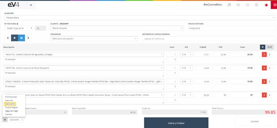
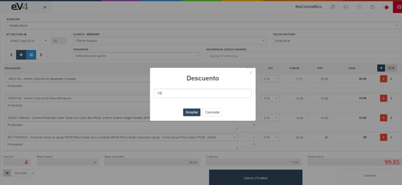
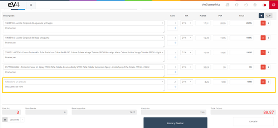

# Descuentos

La opción “**Descuento**” nos permite aplicar un descuento a la factura.

Imagen 146: TPV – Descuentos 1

Pulsamos el botón “Opciones” y seleccionamos “Descuento”

Imagen 147: TPV – Descuento 2

Nos aparecerá una ventana emergente en la que podemos indicar el porcentaje de descuento sobre el total de la factura. Pulsamos el botón “Aceptar” y se nos añadirá una nueva línea a la factura con el importe del descuento realizado.

Imagen 148: TPV – Descuentos 3

[Aplicar descuento en artículos en tpv](https://www.loom.com/share/def3ff89853f43bb92a761265fa1a444?sid=b87599a2-9d55-4516-b970-1b1caedafde5)