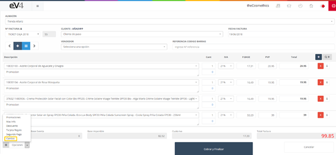
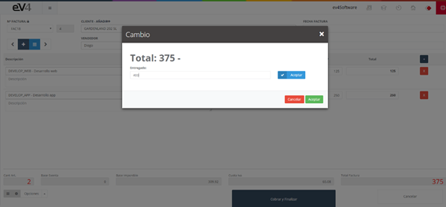
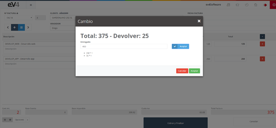

# Cambio

La opción “**Cambio**” nos permite conocer el cambio que hay que devolver al cliente si este entregó un importe superior al total de la factura.

Imagen 154: TPV – Cambio 1

Pulsamos el botón “**Opciones**” y seleccionamos “**Cambio**”.

Imagen 155: TPV – Cambio 2

Nos aparecerá una ventana emergente con el importe de la factura, deberemos añadir el importe entregado por el cliente y pulsamos el botón “**Aceptar**”.

Imagen 156: TPV – Cambio 3

Y se nos mostrará el desglose del importe a devolver al cliente.
