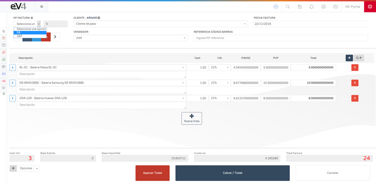

# Hemos hecho la primera venta. Vamos a realizar el primer ticket.

La forma más rápida de crear un ticket consiste en pulsar el botón **AÑADIR** (botón azul en la barra superior derecha) y posteriormente pulsar el botón **NUEVO TPV**.

## TPV

Pulsamos el botón **NUEVO TPV** y nos aparecerá la pantalla para crear el ticket.

Deberemos seleccionar la **SERIE**, el **CLIENTE**, la **FECHA** y el **VENDEDOR**.

Para añadir un producto, podemos leer su código de barras si disponemos de escáner. Pulsamos sobre el campo **REFERENCIA CÓDIGO DE BARRAS**, cuando el campo se ponga azul podemos escribir manualmente la referencia o utilizar el escáner.

Para buscar un artículo por su nombre, pulsamos sobre el campo **SELECCIONE UN ARTÍCULO**, se nos abrirá un buscador donde podremos escribir su nombre. Debajo nos aparecerán todas las coincidencias.

### Opciones de la factura

- Para añadir una nueva línea a la factura, pulsamos el botón **+ NUEVA LÍNEA** que está en el centro de la pantalla o el botón azul con un símbolo **+** de la parte izquierda de la pantalla.
- Para eliminar una línea de la factura, pulsamos el botón rojo con una **x** en su interior.
- El botón gris que contiene **Q+** nos abre un buscador avanzado que nos permite filtrar los artículos por: **NOMBRE**, **REFERENCIA**, **EAN-13**, **MARCA** y **PROVEEDOR**.

### Botones de acción

- El botón rojo **APARCAR TICKET** nos permite “guardar” un ticket sin terminar el proceso del pago, para poder seguir facturando y posteriormente recuperarlo tal y como fue “aparcado” para terminar de cobrarlo.
- El botón **CANCELAR** descarta el ticket y nos devuelve a la pantalla del listado de tickets.
- Pulsamos el botón **COBRAR Y FINALIZAR**, se nos abrirá una ventana donde podremos seleccionar la forma de pago, introducir el importe entregado, marcando los números 0,00 con el ratón y pulsando el botón suprimir del teclado (o borrándolos) para calcular el cambio.

Para terminar la operación, pulsamos el botón **FINALIZAR**.

### Accesos rápidos

- El botón azul claro con tres líneas horizontales de la parte superior derecha de la pantalla nos llevaría al listado de los tickets almacenados en el sistema.

- El botón rojo **TICKETS APARCADOS** de la parte superior de la pantalla nos muestra los tickets “aparcados”.

### Recuperación de tickets

Para recuperar un ticket “aparcado” solamente hay que pulsar sobre él y se nos cargará en pantalla.

El ticket se carga en el mismo estado que estaba antes de ser “aparcado”, excepto un aspecto: la serie que tendrá que ser asignada manualmente. Cuando “aparcamos” un ticket, este se guarda sin serie asignada.

Los dos últimos tickets del listado no tienen serie asignada, porque son tickets “aparcados”.

Los tickets descuentan stock.
