# Cobrar y Finalizar

Veamos con detenimiento las diferentes funciones del botón **“Cobrar y Finalizar”**.

Cuando hemos terminado de añadir todos los artículos a la factura y queremos realizar el cobro, solo tenemos que pulsar el botón **“Cobrar y Finalizar”** y nos aparecerá la siguiente pantalla.

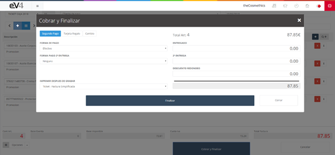

Imagen 157: Cobrar y Finalizar 1

## Funciones disponibles

En la parte superior izquierda tenemos tres botones:

- **Segundo Pago**: Nos permite establecer un segundo pago para la factura.

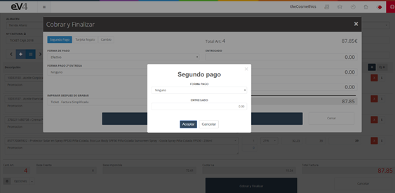

Imagen 158: Cobrar y Finalizar 2

- **Tarjeta Regalo**: Nos permite utilizar una tarjeta regalo que esté almacenada en el sistema.

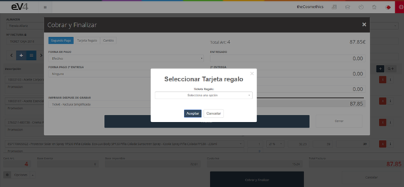

Imagen 159: Cobrar y Finalizar 3

- **Cambio**: Nos indica el cambio a entregar al cliente si éste entrega un importe superior al total de la factura.

También disponemos de los siguientes campos para configurar los distintos aspectos de la factura:

- **Forma de Pago**: Nos permite establecer la forma de pago.

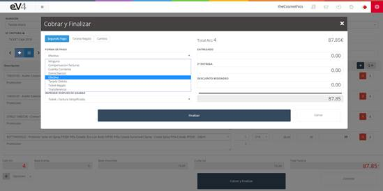

Imagen 160: Cobrar y Finalizar 4

- **Forma Pago 2º Entrega**: Nos permite establecer la forma de pago del segundo pago.

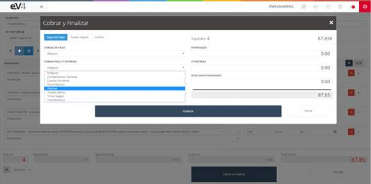

Imagen 161: Cobrar y Finalizar 5

- **IMPRIMIR DESPUES DE GRABAR**: Si seleccionamos **“Ticket – Factura Simplificada”**, después de pulsar el botón **“Finalizar”** nos aparecerá una ventana con el Ticket desde donde lo podremos imprimir, pulsando el botón **“Imprimir”**.

Imagen 162: Cobrar y Finalizar 6

## Introducción del importe a cobrar

Veamos cómo introducir el importe a cobrar:

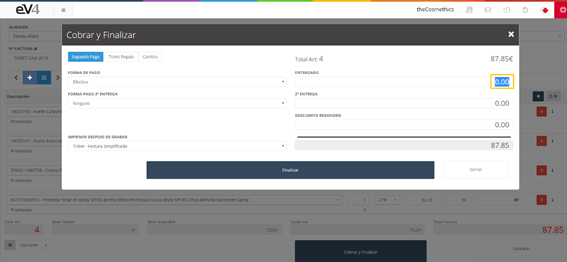

Imagen 163: Cobrar y Finalizar 7

1. Ponemos el cursor del ratón sobre el campo **“ENTREGADO”**, resaltamos la cantidad **0.00** y pulsamos el botón **suprimir**.

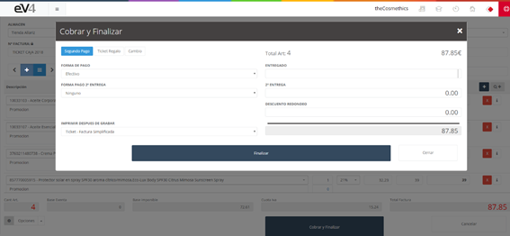

Imagen 164: Cobrar y Finalizar 8

2. En este momento, el campo quedará vacío y podremos escribir la cantidad entregada por el cliente.

Imagen 165: Cobrar y Finalizar 9

3. Podemos introducir un descuento por redondeo si no queremos cobrarle los céntimos al cliente. Para ello, introducimos en el campo **“DESCUENTO REDONDEO”** la cantidad que queremos descontar en negativo.

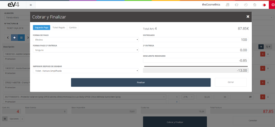

Imagen 166: Cobrar y Finalizar 10

4. Vemos cómo se ha recalculado el cambio.

Imagen 167: Cobrar y Finalizar 11

Si pulsamos sobre el botón **“Cambio”**, nos da un desglose de los billetes y monedas a devolver.

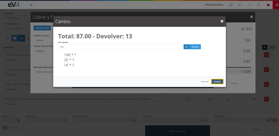

Imagen 168: Cobrar y Finalizar 12

Para cerrar esta ventana emergente, pulsamos el botón **“Aceptar”** situado en la parte inferior derecha de esta ventana.

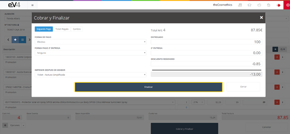

Imagen 169: Cobrar y Finalizar 13

## Finalización de la venta

Para finalizar la venta y que esta quede registrada en el sistema, solo tenemos que pulsar el botón **“Finalizar”**.

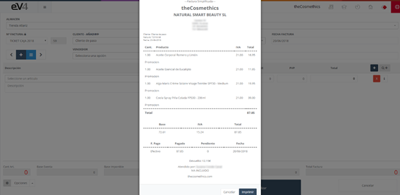

Imagen 170: Cobrar y Finalizar 14

Una vez que la operación ha sido almacenada, nos aparecerá en pantalla el ticket y nos da la opción de imprimirlo si fuese necesario.

Si pulsamos sobre el botón **“Imprimir”**, se nos abrirá la ventana de impresión del navegador que estemos usando para configurar los parámetros de impresión y lanzarla.

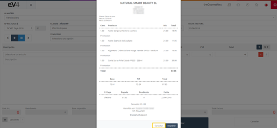

Imagen 171: Cobrar y Finalizar 15

Cuando terminemos de imprimir, pulsamos el botón **cancelar** para cerrar esta ventana y volveremos a la sección **“TPV NUEVO”** para seguir facturando.

## Vista general de la sección TPV

En la vista general de la sección **“TPV”** por defecto solo nos aparecen los tickets/facturas generados durante el día actual. Si queremos ver los de días anteriores, podemos hacerlo mediante los filtros.

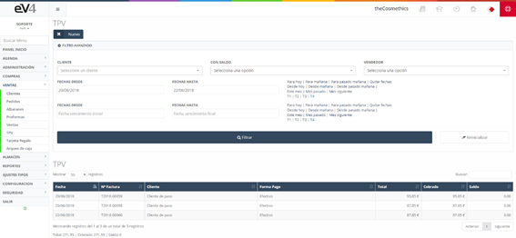

Imagen 172: TPV vista general

El resto del funcionamiento es similar al de ventas tanto a la hora de cobrar la factura, de generarla y de imprimirla o enviarla por email. Incluso la vista es la misma.

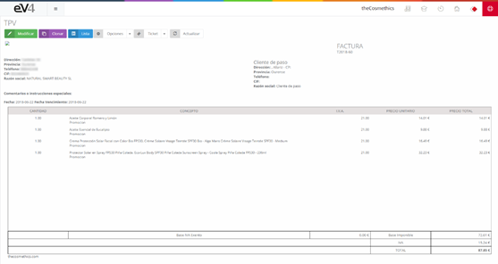

Imagen 173: TPV vista