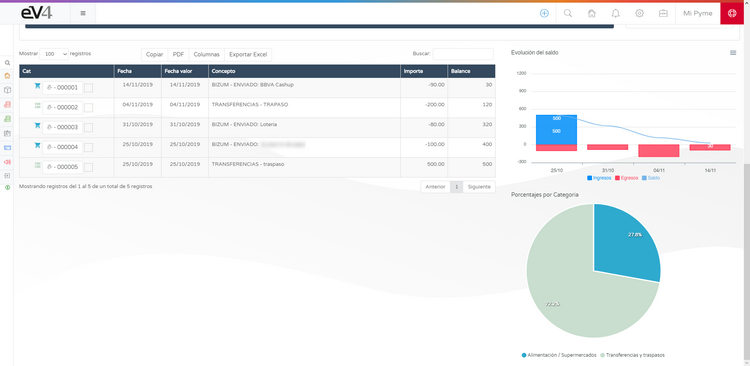

# Conecta con tu Banco

eV4 te permite conectar con tu banco para consultar tus movimientos bancarios. eV4 solo tiene acceso a tus datos bancarios en **modo lectura**, es decir, solo puede consultar dichos datos. Nunca podrá realizar operaciones financieras (pagos, transferencias, etc.).

Esta función se encuentra en el menú **TESORERÍA → BANCOS**.

## Primer acceso

La primera vez que accedemos veremos la siguiente pantalla.

Pulsamos sobre el botón **CONECTA CON TU BANCO** y veremos la siguiente pantalla donde tendremos que seleccionar nuestra entidad bancaria.

eV4 puede trabajar con más de 100 entidades bancarias de Europa y América. Podemos filtrar las entidades bancarias por países, pulsando sobre él o bien buscarlas directamente por su nombre. Cuando la encontremos, pulsamos sobre ella.

eV4 se adapta a la forma de trabajar de cada banco y te solicitará los datos requeridos por el mismo.

Una vez introducidos los datos requeridos, pulsamos el botón **conectar**.

## Solicitar movimientos

La primera vez que eV4 se conecta con su banco, solicita los movimientos del último año. Para solicitar los movimientos de periodos superiores a 90 días, según la normativa europea, su entidad bancaria le ha de facilitar un código de control que debe introducir a continuación.

Pulsamos el botón **VALIDAR** y esperamos a que el proceso termine. Después nos aparecerán en pantalla las cuentas que tengamos en esta entidad bancaria.

Si alguna de las cuentas tiene un símbolo en color rojo de una **i** dentro de un círculo significa que se requiere que el usuario realice alguna acción. Si pulsamos sobre una cuenta, entramos en ella.

Seguimos las instrucciones, en este caso pulsamos sobre el botón **HAGA CLICK PARA REACTIVAR CUENTA**.

Y esperamos a que termine.

## Menú herramientas

En la zona superior de la pantalla, disponemos del menú desplegable **HERRAMIENTAS** con las siguientes opciones:

- **ACTUALIZAR TODAS LAS CUENTAS**: Actualiza los movimientos de todas las cuentas.
- **ACTUALIZAR MOVIMIENTOS**: Actualiza los movimientos de esta cuenta.
- **CONCILIACIÓN AGRUPADA**: Abre la ventana para conciliar los movimientos con las facturas.
- **IMPORTAR NORMA 43**: Importar el archivo de la norma 43 que te facilita el Banco.

- **ASIGNAR CÓDIGO VALIDACIÓN**: Cuando reactivamos una cuenta, nos abre la ventana para introducir el código de verificación.

En la zona superior de la pantalla, disponemos del menú desplegable **OTRAS CUENTAS**, desde el que podremos saltar a otra cuenta directamente, sin pasar por la pantalla bancos.

## Filtrar movimientos

Una vez descargados los movimientos, podemos filtrar el periodo de tiempo que queremos ver, indicando el rango de fechas deseado en el **FILTRO AVANZADO**.

Encima del listado de movimientos, disponemos de 4 botones:

- **COPIAR**: Copia al portapapeles todos los movimientos.
- **PDF**: Genera un documento PDF con los movimientos.

- **COLUMNAS**: Despliega un menú en el que podemos seleccionar las columnas que queremos que se muestren en el listado de los movimientos.

- **EXPORTAR EXCEL**: Genera una hoja de cálculo en formato EXCEL con el listado de movimientos.

## Conciliación bancaria

La conciliación bancaria se refiere a una parte de la gestión de la tesorería de la empresa. Es la acción de justificar cada uno de los movimientos bancarios con nuestras operaciones. Se trata de puntear los diferentes movimientos que hay en el banco con nuestras facturas, determinando que cada una de las transacciones forma parte de una factura.

Para conciliar un movimiento con una factura, en primer lugar tenemos que seleccionar un movimiento marcando la casilla que hay a la derecha del número del mismo y después seleccionar **CONCILIACIÓN AGRUPADA** en el menú **HERRAMIENTAS**.

Si no seleccionamos antes ningún movimiento, veremos el siguiente mensaje de error.

Veremos la siguiente pantalla.

Podemos clasificar los movimientos en diferentes categorías, cada categoría tiene su propio icono.

## Facturas conciliadas

En la parte inferior derecha tenemos 4 pestañas:

- **FACTURAS CONCILIADAS**: Aquí nos aparecerá la factura conciliada con este movimiento.
- **VENTAS**: Aquí nos aparecerán las facturas de venta disponibles en el sistema.
- **COMPRAS**: Aquí nos aparecerán las facturas de compras disponibles en el sistema.
- **ASISTENTE**: Aquí nos aparecerán las facturas que el sistema nos sugiere que pueden estar relacionadas con el movimiento.

Para conciliar el movimiento con una factura, la seleccionamos entre las facturas disponibles, bien sean de compra, venta o sugeridas por el sistema y pulsamos el botón **CONCILIAR**.

Ahora nos aparecerá la factura seleccionada en la pestaña **FACTURAS CONCILIADAS**. Si queremos liberar la factura, solo tenemos que pulsar el botón **DESCONCILIAR**.

## Gráficas interactivas

Una vez que tengamos los movimientos clasificados, las gráficas que tenemos en la parte derecha de la pantalla son interactivas.

En la gráfica de barras podemos activar/desactivar los datos correspondientes pulsando sobre sus nombres: **INGRESOS**, **EGRESOS** y **SALDO**.

La gráfica circular asigna un color para cada categoría que hayamos asignado a los movimientos y pulsando sobre su sección en la gráfica filtraremos los movimientos de esa categoría.

Para volver a recuperar el listado completo de movimientos, pulsamos sobre la leyenda inferior donde se detalla las categorías asignadas.
