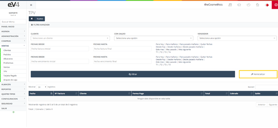

# TPV

El TPV es el panel para gestionar la venta en el propio local de la empresa hacia un cliente de manera fácil y sencilla.

Al acceder, encontramos un listado de todas las facturas realizadas, ya sean de manera manual desde el apartado de ventas o desde el propio TPV, además de un filtro para facilitar toda la búsqueda de estas.

Esta es la vista inicial de la sección “TPV”, inicialmente los campos de búsqueda están por defecto en blanco. Cuando realicemos una búsqueda, los campos conservarán los valores introducidos en esta, por si es necesario volver a repetir una búsqueda relacionada con estos datos.

Si queremos restablecer el estado inicial de la plantilla y borrar los datos de la última búsqueda, podemos hacerlo pulsando el botón **“Reinicializar”**.

## TPV NUEVO

El funcionamiento del panel es similar al de ventas del apartado anterior, pero en este caso toda la distribución está cambiada para tener un uso más amigable.

Inicialmente vemos la vista simplificada de la pantalla TPV, si queremos acceder a la vista completa de dicha pantalla, deberemos dirigirnos al botón desplegable **“Opciones”** situado en la parte inferior derecha de la pantalla.

Y seleccionar la opción **“Mas Info”**. Veremos cómo nos aparecen los campos: **“Tipo Vencimiento”** y **“Fecha Vencimiento”**.

En primer lugar, veamos la función de una serie de botones importantes en la sección **“TPV Nuevo”**:

- **Botón TPV NUEVO (+)**: Botón azul con símbolo + en blanco situado en la parte superior izquierda de la pantalla, debajo del campo **“Nº FACTURA”**. Su función es generar un Ticket nuevo, es decir, borra todos los campos en pantalla y los devuelve a su estado inicial.

  
- **Botón Lista**: Botón azul claro con tres líneas horizontales blancas. Está situado junto al botón **“TPV NUEVO”**. Su función es volver a la sección inicial **“TPV”**.

- **Botones Avance/Retroceso**: Botones situados a izquierda y derecha de los dos botones anteriores. Estos botones nos permiten cargar en pantalla el ticket anterior/posterior y movernos entre ellos.

- **Botón Añadir Artículo**: Botón azul (más pequeño) con símbolo + en blanco situado en la parte superior derecha de la pantalla. La función de este botón es añadir una nueva línea al ticket para añadir un artículo más al mismo.

- **Botón Eliminar (x)**: Botón rojo con una x. Este botón elimina una línea de producto de la factura o ticket. Si se han introducido más líneas de las necesarias o se quiere eliminar alguna línea de las existentes, pulsamos este botón y esa línea será eliminada.

- **Botón Info (i)**: Botón blanco con una i minúscula dentro. El botón **“INFO”** nos da información del producto al que hace referencia esa línea del ticket o factura. 

Si pulsamos sobre él, nos salta una ventana emergente con la información del producto. Para cerrar esta ventana, pulsamos el botón **“OK”**.

- **Botón Consultar Catalogo (Q+)**: Botón gris con el símbolo **Q+** que se encuentra a la derecha del botón **“Añadir Artículo”**. La función de este botón es muy práctica. Para añadir un artículo al ticket, si lo hacemos desde el campo habilitado por defecto, solo nos permite buscar por nombre. Con este botón podemos buscar un artículo por los siguientes criterios:
  - **NOMBRE**
  - **REFERENCIA**
  - **EAN-13**
  - **MARCA**
  - **PROVEEDOR**

### Buscar por NOMBRE

Para buscar un artículo por su nombre, lo escribimos en el campo **“NOMBRE”**.

Pulsamos el botón **“FILTRAR”** para que se muestren los resultados.

Ahora, para añadir un artículo al ticket o factura, hacemos **doble clic** sobre él.

Por cada vez que se haga doble clic sobre un artículo, se añadirá una unidad más del mismo al ticket o factura.

### Buscar por REFERENCIA

Podemos buscar por **“REFERENCIA”**, escribimos la referencia de un artículo en el campo correspondiente y pulsamos el botón **“FILTRAR”**.

El sistema nos mostrará las coincidencias.

Para añadir el artículo al ticket, hacemos **doble clic** sobre él.

### Buscar por EAN-13 (o código de barras JAN)

El funcionamiento es exactamente igual que para el campo **“REFERENCIA”**.

### Buscar por MARCA

Podemos buscar por **“MARCA”**: Pulsamos sobre el campo **“MARCA”** y se nos abre un desplegable en el que podremos escribir el nombre de la marca para que el sistema filtre la búsqueda o bien seleccionar una de las que se listan. Seleccionamos una marca y pulsamos el botón **“FILTRAR”**.

El sistema nos traerá un listado con todos los artículos de la marca seleccionada que tengamos registrados.

Para añadir un artículo al ticket, hacemos **doble clic** sobre él.

### Buscar por PROVEEDOR

Podemos buscar por **“PROVEEDOR”**: Pulsamos sobre el campo **“PROVEEDOR”** y se nos abre un desplegable en el que podremos escribir el nombre del proveedor para que el sistema filtre la búsqueda o bien seleccionar uno de los que se listan. Seleccionamos un proveedor y pulsamos el botón **“FILTRAR”**. El sistema nos traerá un listado con todos los artículos del proveedor seleccionado que tengamos registrados. Para añadir un artículo al ticket, hacemos **doble clic** sobre él.

Todos estos criterios de búsqueda se pueden combinar para hacer la búsqueda de forma más precisa.

### Campos disponibles en la ventana TPV

- **Nº Factura**: En este campo podemos seleccionar la serie a la que pertenecerá la factura generada.
- **Cliente – Añadir+**: Nos permite seleccionar el cliente para el que se emitirá la factura.
- **Fecha Factura**: Nos permite fijar la fecha de la factura.
- **Tipo Vencimiento**: Nos permite seleccionar si la factura se cobrará en efectivo o a 30, 60 o 90 días.
- **Fecha Vencimiento**: Nos permite fijar la fecha de vencimiento de la factura.
- **Vendedor**: Nos permite seleccionar el vendedor al que se le asignará esa venta.
- **Referencia Código Barras**: Nos permite leer el código de barras de un producto mediante una pistola externa o bien escribirlo a mano.
- **Artículo**: Dispondremos de una línea diferente para cada artículo que integre la factura.

### Opciones disponibles a través del botón “Opciones”

- **Promociones**: Nos permite seleccionar una promoción vigente.
- **Mas Info**: Nos permite pasar de la vista simplificada a la vista completa y viceversa en la ventana de TPV.
- **Descuento**: Nos permite aplicar un descuento a la factura.
- **Tarjeta Regalo**: Nos permite cargar a la factura una tarjeta regalo.
- **Segundo Pago**: Nos permite establecer un segundo pago para la factura.
- **Cambio**: Nos indica el cambio a entregar al cliente.

Veamos con más detenimiento estas opciones: