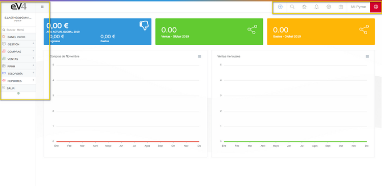
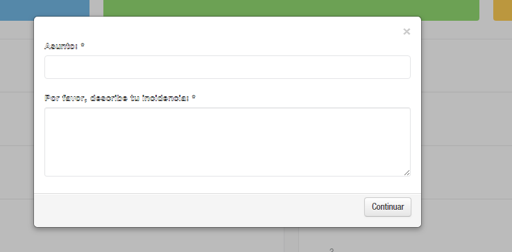

# INTERFAZ  

**Bienvenido a eV4ERP, hacemos sencillo lo complejo.**  
Nuestro software te permitirá **gestionar tu negocio** de una forma más eficiente.  
Vamos a conocer rápidamente la interfaz de eV4ERP.  

---

## BARRAS DE HERRAMIENTAS  

eV4ERP dispone de **dos barras de herramientas** principales.  

### **1.- BARRA SUPERIOR DERECHA**  
En la parte superior derecha de la pantalla tenemos la **barra de acceso rápido**, que cuenta con **ocho botones** para ejecutar funciones con un solo clic.  

Estos botones son, de izquierda a derecha:  

- **Más:** Permite **crear** un nuevo cliente, una nueva factura de venta, un nuevo ticket, un nuevo proveedor, una nueva factura de compra o acceder a los reportes.  

- **BUSCAR:** Nos permite **buscar artículos, clientes, proveedores, etc.** en la base de datos. 

Al pulsarlo, se abrirá una ventana para introducir los términos de búsqueda.

- **PANEL DE INICIO:** Nos lleva directamente al **panel de inicio**.  

- **NOTIFICACIONES:** Abre un panel desplegable con las **notificaciones** del sistema.  

- **CONFIGURACIÓN:** Permite acceder a **7 opciones** de configuración de eV4ERP.  

- **HERRAMIENTAS:** Proporciona acceso a **4 herramientas**, incluyendo **sincronización con PrestaShop** (si está contratado), descarga de **Anydesk**, consulta de **tickets e incidencias**, e **invitaciones**.  

- **EMPRESA:** Permite **configurar o modificar los datos** de la empresa.  

- **SOPORTE:** Botón rojo para **enviar un ticket de asistencia** al departamento de soporte.  

---

### **2.- COLUMNA IZQUIERDA**  
En la columna de la izquierda encontramos el **menú de navegación** que da acceso a todas las funciones de eV4ERP.  
Este panel puede ser **desplegado u ocultado** pulsando el botón con **tres líneas horizontales**.  

#### **Elementos del menú:**  
- **BUSCADOR:** Permite **buscar secciones** del menú escribiendo su nombre.  
- **PANEL INICIO:** Nos lleva al **panel de inicio** desde cualquier sección.  
- **GESTIÓN:** Permite gestionar el **catálogo de productos**.  
- **COMPRAS:** Gestión de **proveedores, albaranes y compras**.  
- **VENTAS:** Gestión de **clientes, pedidos, albaranes, presupuestos y facturas**.  
- **RRHH:** Gestión de **empleados, centros de trabajo y nóminas**.  
- **TESORERÍA:** Gestión de **arqueos de caja y cuentas bancarias**.  
- **REPORTES:** Consulta de **diferentes reportes**.  
- **SALIR:** Botón para **cerrar la aplicación**.  

---