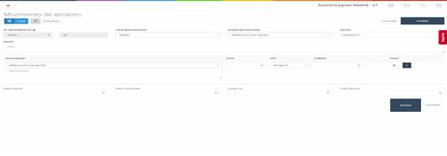

# **Movimientos – Traspaso de Central a Tienda**

Para realizar un **traspaso** de uno o varios artículos desde la **central** a la **tienda**, debemos pulsar el botón **"Traspaso de Central a Tienda"** en la pantalla inicial de **movimientos**. Esto nos llevará a una nueva pantalla con varios campos a completar.

---

## **Campos a Completar en el Traspaso de Central a Tienda**  

1. **Nº Movimiento:**  
   - Por defecto, este campo está **bloqueado**. Para desbloquearlo, pulsa sobre el **candado** que aparece junto a él.  
   - Este campo corresponde al **identificador del movimiento**.

2. **Tipo Movimiento:**  
   - Indica el **tipo de movimiento** que se está realizando.

3. **Almacén Destino:**  
   - El almacén al que se enviarán los **artículos**.

4. **Fecha:**  
   - La **fecha** en la que se realizó el movimiento.

5. **Nota:**  
   - Una **nota informativa** sobre el movimiento.

6. **Descripción:**  
   - **Producto** y su respectiva **descripción**.

7. **Cant:**  
   - La **cantidad** de un producto en el traspaso.

8. **IVA:**  
   - El **IVA** asociado al producto.

9. **P. Base:**  
   - El **precio base** del producto.

10. **Total:**  
    - El **precio total** de la cantidad de productos indicados.

11. **Botón Añadir:**  
    - Permite **añadir una nueva línea de producto** al traspaso.

12. **Base Exenta:**  
    - El **precio base exento de IVA**.

13. **Base Imponible:**  
    - El **importe sobre la renta** obtenida.

14. **Cuota IVA:**  
    - El **IVA asociado** a la transacción.

15. **Total Factura:**  
    - El **precio total** de la factura.

---

## **Movimientos – Traspaso de Tienda a Central**

Para realizar un **traspaso** de uno o varios artículos desde una **tienda** a la **central**, debemos pulsar el botón **"Traspaso de Tienda a Central"** en la pantalla inicial de **movimientos**. Esto nos llevará a una nueva pantalla con los siguientes campos a completar.

---

## **Campos a Completar en el Traspaso de Tienda a Central**  

1. **Nº Movimiento:**  
   - Al igual que en el traspaso de central a tienda, este campo está **bloqueado** por defecto. Para desbloquearlo, pulsa sobre el **candado**.  
   - Es el **identificador del movimiento**.

2. **Tipo Movimiento:**  
   - Indica el **tipo de movimiento**.

3. **Almacén Origen:**  
   - El almacén desde donde se enviarán los **artículos**.

4. **Fecha:**  
   - La **fecha** en la que se realizó el movimiento.

5. **Nota:**  
   - **Nota informativa** sobre el movimiento.

6. **Descripción:**  
   - **Producto** y su respectiva **descripción**.

7. **Cant:**  
   - La **cantidad** de un producto a mover.

8. **IVA:**  
   - El **IVA** asociado al producto.

9. **P. Base:**  
   - El **precio base** del producto.

10. **Total:**  
    - El **precio total** de la cantidad de productos indicados.

11. **Botón Añadir:**  
    - Permite **añadir una nueva línea de producto** al traspaso.

12. **Base Exenta:**  
    - El **precio base exento de IVA**.

13. **Base Imponible:**  
    - El **importe sobre la renta** obtenida.

14. **Cuota IVA:**  
    - El **IVA asociado**.

15. **Total Factura:**  
    - El **precio total** de la factura.

---