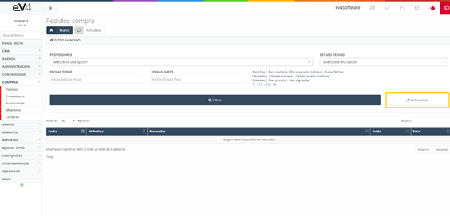
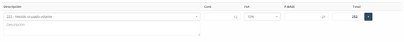
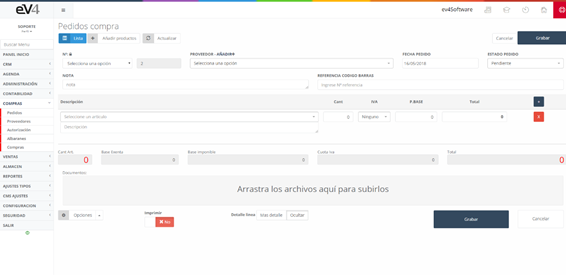
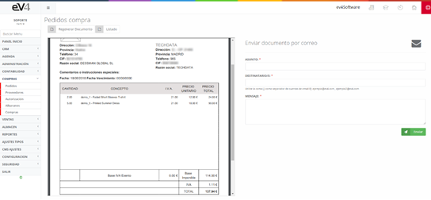

---

title: Pedidos
description: Pedidos

---

# **Pedidos de Compra**

En la **pantalla principal de pedidos** encontramos un listado de los distintos **pedidos de compras** que se han realizado desde el sistema. Además de este listado, se incluye un **filtro** para buscar pedidos por **fechas**, **almacenes**, **proveedores** o el **estado** en el que se encuentre el pedido.

---

## **Vista Inicial y Filtros**

Esta es la vista inicial de la sección **“PEDIDOS COMPRA”**. Los **campos de búsqueda** están inicialmente en blanco, pero al realizar una búsqueda, los **valores introducidos** se mantienen para facilitar búsquedas futuras. Si necesitamos restablecer el estado inicial de la pantalla y borrar los datos de la última búsqueda, podemos hacerlo pulsando el botón **“Reinicializar”**.

---

## **Pedidos – Nuevo**

Para introducir un **nuevo pedido de compra**, solo debemos pulsar sobre el botón **"Nuevo"**. Esto abrirá un formulario con los siguientes campos a completar:

1. **N.º Factura:**  
   - El número de la factura es asignado automáticamente por el sistema, pero puede ser **modificado** si es necesario pulsando el **candado**.

2. **Proveedor:**  
   - El **proveedor** al que se le realiza el pedido de compra.

3. **Fecha Pedido:**  
   - La **fecha** en la que se realiza el pedido.

4. **Estado del Pedido:**  
   - El **estado** en el que se encuentra el pedido.

5. **Nota:**  
   - Un **texto informativo** sobre el pedido generado.

6. **Auto Pedido:**  
   - Este botón añade las **líneas de pedido** correspondientes según el proveedor seleccionado, las cantidades mínimas de pedido y el stock disponible.

---

## **Tabla de Productos en el Pedido**

Para agregar productos al pedido, se utiliza la tabla mostrada en la siguiente imagen. Los campos a completar son:

1. **Descripción:**  
   - Se selecciona el **producto** y se puede añadir una **descripción adicional**.

2. **Cant.:**  
   - La **cantidad** del producto que se desea pedir.

3. **IVA:**  
   - El **IVA** del producto seleccionado.

4. **Precio Base:**  
   - El **precio sin IVA** del producto.

5. **Total:**  
   - El **total** calculado del producto, teniendo en cuenta las cantidades, el precio base y el IVA. Este valor se genera **automáticamente**.

---

## **Botones en la Tabla de Productos**

- **Botón “+”**:  
  - Permite **añadir otra línea** de producto al pedido, copiando los datos de la línea seleccionada.

- **Botón “x”**:  
  - Elimina la línea seleccionada. Es importante destacar que siempre debe haber al menos una línea de producto en el pedido, por lo que este botón no estará disponible en la primera línea.

---

## **Campos Adicionales en el Formulario General**

1. **Base Exenta:**  
   - El **precio base exento de IVA** se genera automáticamente al rellenar los campos de los productos seleccionados.

2. **Base Imponible:**  
   - La **base imponible** del precio de los productos seleccionados, que también se genera automáticamente.

3. **Cuota IVA:**  
   - El **total del IVA** añadido según los productos seleccionados, que se genera automáticamente.

4. **Total Factura:**  
   - El **total de la factura**, calculado automáticamente a partir de los productos seleccionados.

5. **Documentos:**  
   - Se pueden **adjuntar documentos** al pedido, los cuales son **privados** y solo estarán disponibles dentro del sistema para orientarse en el pedido.

6. **Imprimir:**  
   - Si se selecciona **“Sí”** al grabar, el sistema generará automáticamente el **PDF del pedido**, que podrá ser **imprimido** o enviado por **email**.

---