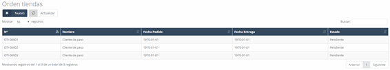
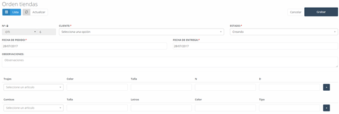

---

title: Orden de tienda
description: Orden de tienda

---

# **Orden De Tiendas**

En este apartado podemos encontrar todas las **órdenes de tiendas** que han sido gestionadas. Al acceder a una orden ya creada, se nos da la opción de **imprimir** la orden pulsando el botón **Imprimir**.

---

## **Vista Inicial y Acceso a la Orden de Tienda**

Una vez dentro de la sección de **“Ordenes de Tiendas”**, podremos ver todas las órdenes gestionadas, y se nos ofrecerán diferentes acciones, incluida la opción de **imprimir** la orden seleccionada.

---

## **Orden de Tiendas – Nuevo**

Para crear una **nueva orden de tienda**, debemos pulsar el botón **“Nuevo”** en la pantalla inicial. Al hacer esto, aparecerá un formulario en el que debemos completar los siguientes campos:

### Campos Generales:

1. **N.º Factura:**  
   - Es el **número de la factura** que identifica la orden. Este número es asignado automáticamente por el sistema, aunque es posible **modificarlo** si es necesario pulsando el **candado**.

2. **Cliente:**  
   - El **cliente** al que va asociada la orden.

3. **Estado:**  
   - El **estado** actual de la orden, que puede ser uno de los siguientes:
     - **Creando**: Es el estado inicial. La orden aún no ha sido enviada y no aparece en el perfil del taller.
     - **Enviada**: La orden ha sido creada y enviada, y ya es visible en el perfil del taller. En este estado, la orden queda bloqueada en el perfil de la tienda.
     - **En proceso**: La orden ha llegado al taller y está siendo trabajada.
     - **Terminado**: La orden ha finalizado y está completa.
     - **Incidencia**: Si la orden presenta algún tipo de problema o imprevisto que dificulte su finalización.

4. **Fecha de Pedido:**  
   - La **fecha** en la que se realiza el pedido de la orden.

5. **Fecha de Entrega:**  
   - La **fecha de entrega** establecida para la orden.

6. **Observaciones:**  
   - En este campo podemos apuntar cualquier **nota** o **observación** importante relacionada con la orden.

---

## **Información Adicional para la Orden**

Después de estos campos generales, se presentan una serie de campos adicionales donde debemos ingresar la información **específica** necesaria para llevar a cabo la orden. 

---