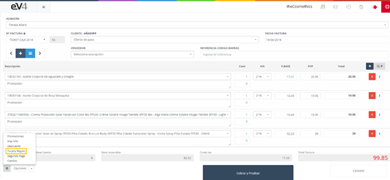
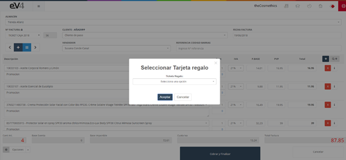

La opción **“Tarjeta Regalo”** nos permite canjear una tarjeta regalo registrada en el sistema. La creación de Tarjetas Regalo se verá con mayor detalle en el apartado **7.8 Tarjeta regalo** del manual.

Pulsamos el botón **“Opciones”** y seleccionamos **“Tarjeta Regalo”**.

Nos aparecerá una ventana emergente en la que podemos elegir la tarjeta de regalo del cliente entre las que se encuentre registradas en el sistema. Pulsamos el botón **“Aceptar”** y se nos añadirá una nueva línea a la factura con el importe del descuento realizado.

