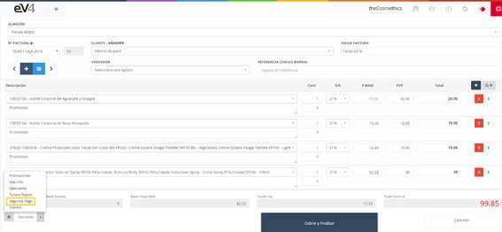
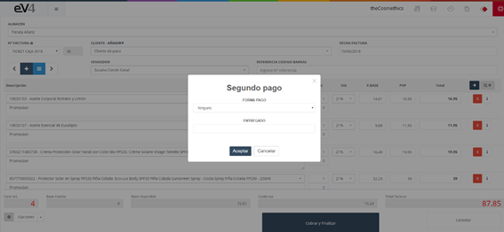
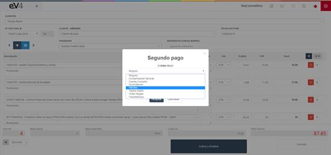

La opción **“Segundo pago”** nos permite fraccionar el pago de la factura entre diferentes formas de pago en una sola operación. Por ejemplo, si un cliente quiere abonar 110 €, pero quiere pagar 60 € en efectivo y 50 € con tarjeta.

Pulsamos el botón **“Opciones”** y seleccionamos **“Segundo pago”**.

Nos aparecerá una ventana emergente en la que en el campo **“Forma Pago”** podemos elegir la forma de pago (efectivo, tarjeta, Paypal, etc). Y en el campo **“Entregado”** ponemos el importe o la cantidad de dinero que se quiere pagar a través de ese medio de pago.

Cuando terminemos pulsamos el botón **“Aceptar”**.