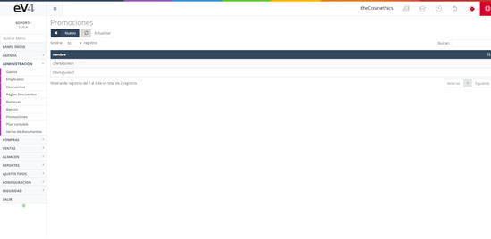
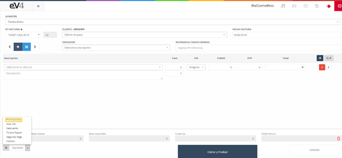
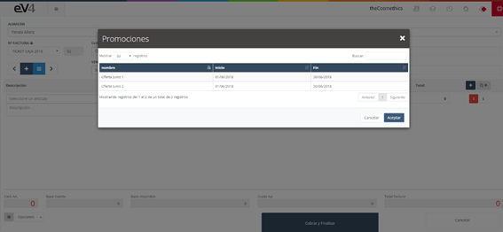
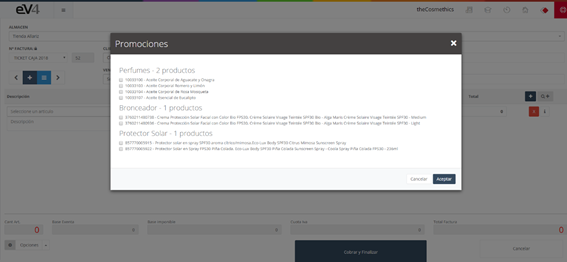
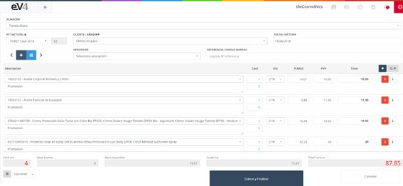

Seleccionando la opción **“Promociones”** nos abrirá una ventana emergente con el listado de promociones activas (si la promoción ha expirado no aparecerá reflejada en esta ventana emergente). Elegimos la promoción deseada, para, posteriormente seleccionar los productos que se incluirán en la misma. De esta forma, los productos se añaden automáticamente como líneas de la venta.

Estas son las promociones registradas en el sistema. Podemos consultarlas en la sección **“Ventas – Promociones”**.

En la vista **“TPV”** pulsamos el botón **“Opciones”** y seleccionamos **“Promociones”**.

Nos aparecerá una ventana emergente con las promociones vigentes.

Para seleccionar una promoción pulsamos sobre ella.

Seleccionamos los productos deseados.

Pulsamos “Aceptar” y los productos seleccionados se añadirán a la factura.

