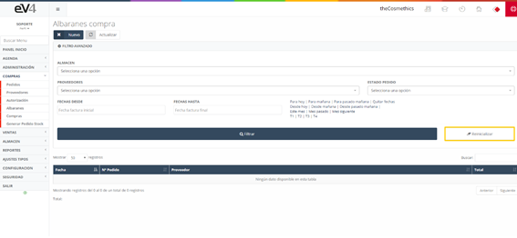
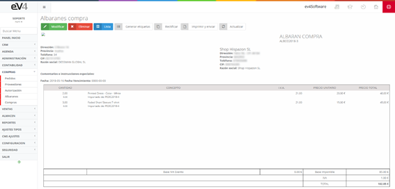

Este apartado contiene los albaranes generados a partir de un pedido de compra realizado a un proveedor, como explicamos antes, podemos crear el albarán de la factura de compra desde el apartado de pedidos o bien crear uno nuevo desde el apartado de albarán, en la sección de compras.

En la pantalla de albarán de compra nos encontramos con el listado de albaranes y un filtro exactamente igual al de pedidos.  El funcionamiento es el mismo que el utilizado para la creación de un pedido de compra, con la diferencia de que esta vez estamos creando un albarán y no un pedido.

#### Vista inicial de la sección "ALBARANES COMPRA"

Esta es la vista inicial de la sección **“ALBARANES COMPRA”**, inicialmente los campos de búsqueda están por defecto en blanco. Cuando realicemos una búsqueda, los campos conservarán los valores introducidos en esta, por si es necesario volver a repetir una búsqueda relacionada con estos datos.

Si queremos restablecer el estado inicial de la plantilla y borrar los datos de la última búsqueda podemos hacerlo pulsando el botón **“Reinicializar”**.

Si pulsamos sobre un albarán de la lista veremos la pantalla siguiente.

Desde esta ventana podemos:

- **Modificar** el albarán pulsando el botón verde **MODIFICAR**.
- **Eliminar** el albarán pulsando el botón rojo **ELIMINAR**.
- **Volver** a la pantalla anterior pulsando el botón azul **LISTA**.
- Si pulsamos el botón **RECTIFICAR**, generaremos un albarán igual al que tenemos, pero con la misma cantidad de productos en negativo para que la suma con los productos de ambos albaranes sea cero.
- Si pulsamos el botón **IMPRIMIR Y ENVIAR**, nos iremos a la pantalla del apartado **6.4.2**.