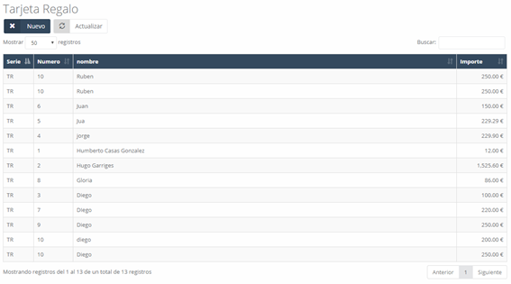
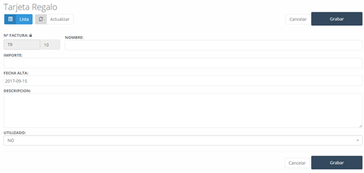

En este apartado podemos consultar las **tarjetas regalo** que hay emitidas, así como crear nuevas.

## Tarjetas regalo – Nuevo

Para crear una nueva tarjeta regalo solo habrá que pulsar el botón **“Nuevo”** y completar el formulario con los datos pertinentes:

- **N.º Factura**: Será el número que identifique a la tarjeta.
- **Nombre**: Nombre que se desea dar a la tarjeta.
- **Importe**: Será la cantidad de dinero a la que es equivalente el uso de la tarjeta regalo.
- **Fecha alta**: La fecha en la que se ha generado la tarjeta.
- **Descripción**: En este campo se puede añadir la información que se considere importante.
- **Utilizado**: Indicará si la tarjeta ya se ha usado o no. Si ya ha sido utilizada, no será posible utilizarla más veces en el sistema.

