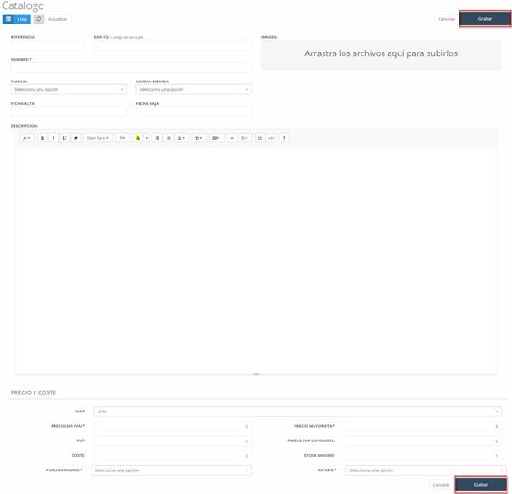

### Stock

Al acceder a **catálogo**, en la pantalla principal encontraremos el listado (ver Imagen 78: Almacén – Catálogo) con los productos introducidos en el sistema (inicialmente este estará vacío).

#### Stock - Nuevo (producto)

Para añadir un nuevo producto a nuestro catálogo, debemos pulsar sobre el botón **nuevo** en la pantalla inicial de catálogo (ver Imagen 78: Almacén – Catálogo). Al realizar esta acción, nos aparecerá una pantalla con un formulario a cumplimentar con la información del producto (ver Imagen 79: Almacén - Catálogo – Nuevo). Los datos a cumplimentar son:

- **Referencia**: Código para identificar el producto.
- **EAN-13**: Código de barras.
- **Nombre**: Nombre del artículo o producto.
- **Nombre resumido**: Nombre abreviado del artículo o producto.
- **Imagen**: Imagen del producto.
- **Marca**: Marca del producto.
- **Familia**: Categoría o familia a la que pertenece un producto.
- **Unidad de medida**: Manera de medir el producto (unidad, centímetros, etc.).
- **Fecha alta**: Fecha desde la cual el producto estará disponible.
- **Fecha baja**: Fecha desde la cual el producto no estará disponible.
- **Descripción**: Descripción detallada del producto.
- **IVA**: IVA aplicado al producto.
- **Precio (sin iva)**: Precio del producto sin iva.
- **PVP**: Precio de venta al público.
- **Coste**: Coste del producto.
- **Publica Online**: Indica si el artículo será visible en la tienda online (prestashop).
- **Precio mayorista**: Precio de venta a mayoristas.
- **Precio PVP mayorista**: Precio de venta al público para mayoristas.
- **Stock mínimo**: Indica el número de artículos a partir del cual, el sistema considerará que el artículo “agotado”, es decir, bajo mínimo de existencias.
- **Estado**: Estado en el que se encuentra el producto.

Una vez hayamos rellenado por completo el formulario debemos pulsar el botón **grabar** para que este sea almacenado en el sistema.

#### Stock – Modificar (Pestañas)

Para realizar una modificación sobre un producto ya existente en el catálogo (ver Imagen 78: Almacén – Catálogo), debemos hacer **click** sobre el producto a modificar, lo que nos mostrará una nueva pantalla (ver Imagen 80: Almacén - Catálogo – Modificar) con una serie de pestañas asociadas al producto.

Para poder realizar la modificación de cualquiera de los campos de las pestañas del producto seleccionado debemos previamente pulsar sobre el botón **modificar** y posteriormente sobre el botón **grabar** para que los cambios queden guardados.

#### Las pestañas que encontramos dentro de un producto cuando va a ser modificado son:

- **Ficha**: Contiene toda la información principal del producto (ver Imagen 80: Almacén - Catálogo – Modificar).
  
- **Imágenes**: Incluye las imágenes asociadas al producto. Además, nos permite añadir nuevas imágenes.

- **Combinaciones**: Permite configurar y combinar los productos por atributos.

- **Proveedores**: Contiene los proveedores asociados al producto, así como añadir un nuevo proveedor.

- **Documentos**: Incluye los documentos que se hayan asociados al producto. Además, nos permite adjuntar nuevos documentos al producto.

- **Existencias**: Número de productos disponibles. Dentro de esta pestaña podemos encontrar el número mínimo de stock y las existencias del producto clasificada por su combinación, es decir, por su grupo de atributos. Además, en el campo *Cant. Pedidos*, podemos ver la cantidad de producto que tenemos bajo pedido, la cual pasará a cero en el momento que creemos el albarán correspondiente al pedido de dicho producto y será sumada en el campo existencias.

- **Prestashop**: Sincroniza el artículo con prestashop en caso de estar previamente activado para su sincronización en la pestaña Ficha.

---

#### Movimientos

En este apartado del sistema encontramos un listado con los movimientos referentes al almacén, como son las entradas y salida de los artículos (ver Imagen 81: Almacén - Movimientos - Listado de movimientos). Además, nos permite filtrar los movimientos por fechas o productos.

#### Movimientos – Nuevo

Para poder crear un nuevo movimiento, debemos pulsar sobre el botón **nuevo** dentro de la pantalla principal de movimientos (ver Imagen 81: Almacén - Movimientos - Listado de movimientos), esto nos mostrará una nueva pantalla con una serie de campos a completar (ver Imagen 82: Almacén - Movimiento - Nuevo).

## Los campos a cumplimentar son:

- **Nº movimiento**: Por defecto este campo se encuentra bloqueado, por lo que es necesario desbloquearlo pulsando sobre el candado que aparece en el mismo. Se corresponde con el identificador del movimiento.
  
- **Tipo movimiento**: Indica qué tipo de movimiento es.
  
- **Fecha**: Fecha cuando se realizó el movimiento.
  
- **Nota**: Nota informativa sobre el movimiento.
  
- **Descripción**: Producto y descripción del mismo.
  
- **Cant**: Cantidad de un producto.
  
- **IVA**: IVA asociado al producto.
  
- **P. Base**: Precio base del producto.
  
- **Total**: Precio total de la cantidad de productos indicados.
  
- **Botón añadir**: Permite añadir una nueva línea de producto.
  
- **Base exenta**: Precio base exento de IVA.
  
- **Base imponible**: Importe sobre la renta obtenida.
  
- **Cuota IVA**: IVA asociado.
  
- **Total factura**: Precio total de la factura.

Una vez hayamos completado los campos, debemos pulsar sobre el botón **grabar** para que el nuevo movimiento quede grabado en el sistema.