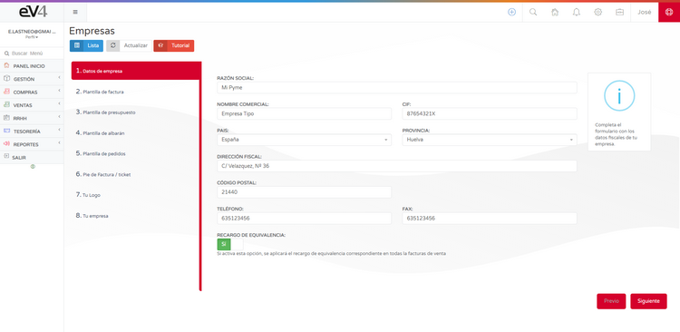
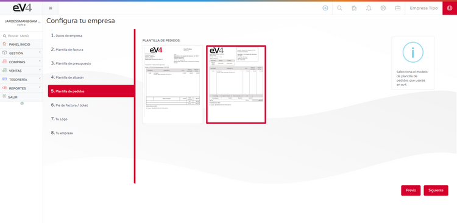
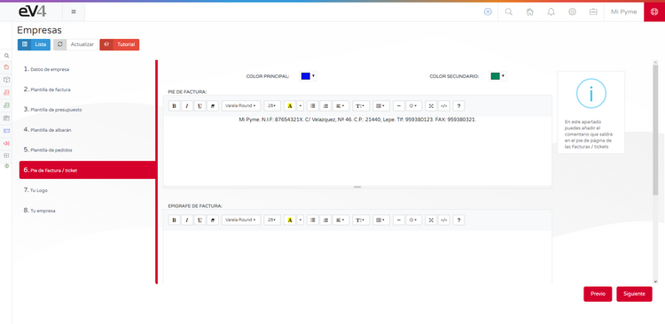
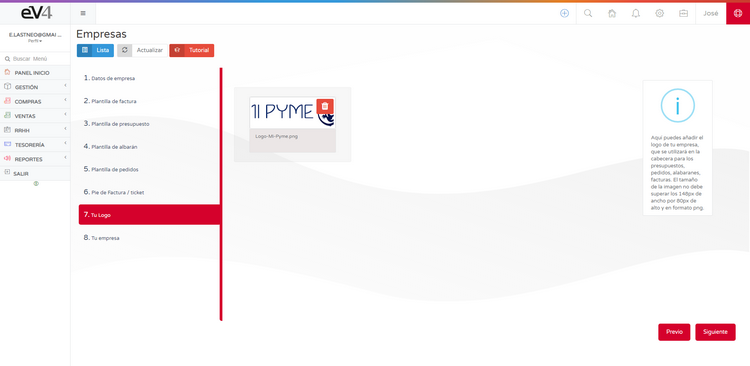
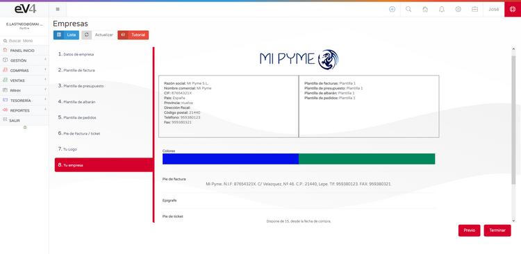

# Configuración Inicial

El asistente de configuración inicial nos permite configurar los aspectos básicos del sistema en ocho pasos de una manera rápida y sencilla.

## 1. Datos de la Empresa

- **Razón Social:** Razón social de la empresa.
- **Nombre Comercial:** Nombre de la empresa.
- **NIF:** Número de Identificación Fiscal de la empresa.
- **País:** País en el que se encuentra registrada la empresa.
- **Provincia:** Provincia en la que se encuentra registrada la empresa.
- **Dirección Fiscal:** Dirección en la que se encuentra registrada la empresa.
- **Código Postal:** Código Postal de la localidad donde se encuentra registrada la empresa.
- **Teléfono:** Teléfono de la empresa.
- **Fax:** Fax de la empresa.
- **Recargo de Equivalencia:** SI/NO. Si activa esta opción, se aplicará el recargo de equivalencia correspondiente en todas las facturas de venta.

## 2. Plantilla de Factura

En esta pantalla podemos seleccionar la plantilla que utilizará el sistema para las facturas. Solamente tendremos que pulsar sobre la plantilla elegida y a continuación pulsar el botón **Siguiente**.

## 3. Plantilla de Presupuesto

En esta pantalla podemos seleccionar la plantilla que utilizará el sistema para los presupuestos. Solamente tendremos que pulsar sobre la plantilla elegida y a continuación pulsar el botón **Siguiente**.

## 4. Plantilla de Albarán

En esta pantalla podemos seleccionar la plantilla que utilizará el sistema para los albaranes. Solamente tendremos que pulsar sobre la plantilla elegida y a continuación pulsar el botón **Siguiente**.

## 5. Plantilla de Pedidos

En esta pantalla podemos seleccionar la plantilla que utilizará el sistema para los pedidos. Solamente tendremos que pulsar sobre la plantilla elegida y a continuación pulsar el botón **Siguiente**.

## 6. Píe de Factura/Ticket

En esta pantalla podemos personalizar el texto que aparecerá en el píe de las facturas, el píe de los tickets y el epígrafe de las facturas. Cuando terminemos solamente tendremos que pulsar el botón **Siguiente**.

## 7. Tu Logo

En esta pantalla puedes añadir el Logo de tu empresa. Las medidas de la imagen han de ser **280 x 72 pixels** y en formato **PNG**.

- Pulsar sobre el símbolo de la papelera para eliminar la imagen existente.
- Arrastrar el logo de nuestra empresa a este lugar.
- A continuación, pulsar el botón **Siguiente**.

## 8. Tu Empresa

En este último paso tenemos un resumen de todos los ajustes realizados.

- Ahora podemos comprobar que todos los datos son correctos.
  - En caso afirmativo, pulsamos el botón **Terminar**.
  - En caso contrario, pulsamos el botón **Previo** las veces que sea necesario hasta llegar a la pantalla donde se encuentre el dato que queremos corregir.