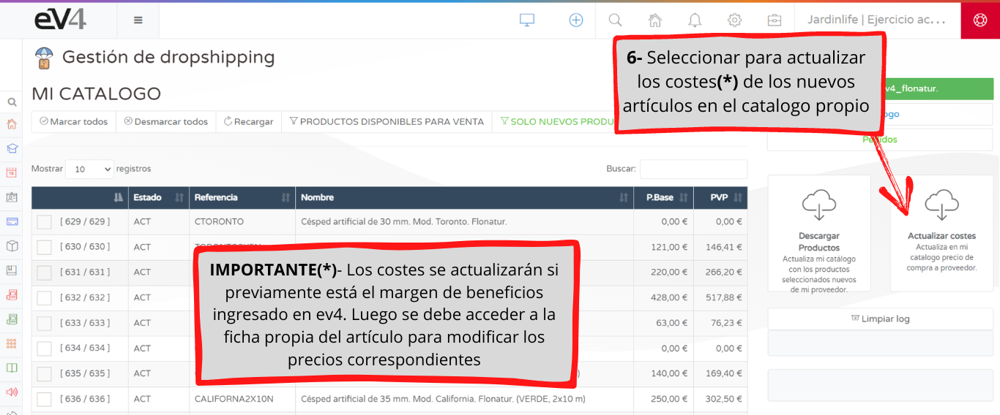

¿Cómo proceder cuando el proveedor de Dropshipping incorpora nuevos articulos a su catálogo? Te mostramos en simples pasos como incorporar los nuevos artículos al catálogo del vendedor de Dropshipping en ev4, sincronizandolos de forma automática.

