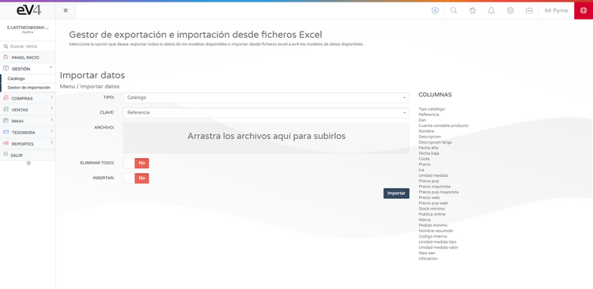

# Inventario  

**Para poder empezar a vender, primero necesitas tener inventario.**
Puedes crear artículos para tu inventario de manera manual desde la sección: **GESTIÓN → CATÁLOGO**.  

## Creación de Productos  

Si pulsamos sobre el botón **NUEVO**, se nos abrirá la ficha de producto a completar. 

También podemos **importar/exportar** el catálogo desde ficheros Excel con nuestro **GESTOR DE IMPORTACIÓN**.  

Recomendamos utilizar la plantilla que se aporta para un mayor control de los datos a importar.  
Cuando hayas creado o importado tus productos, podrás empezar a crear y gestionar **pedidos, albaranes y ventas**.  

## Exportación del Catálogo  

Puedes exportar tu catálogo en su totalidad o sólo parcialmente.  

Cuando hayas creado o importado tus productos, podrás empezar a crear y gestionar **pedidos, albaranes y ventas**.  

