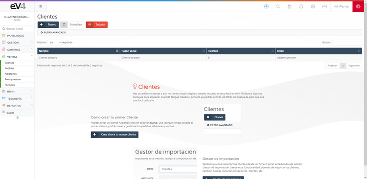
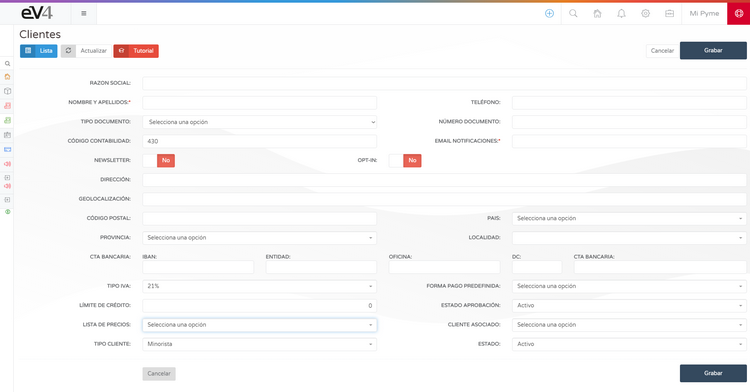
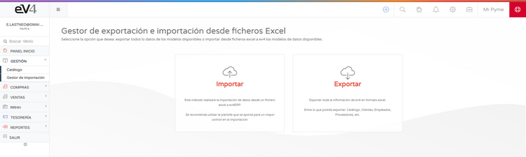
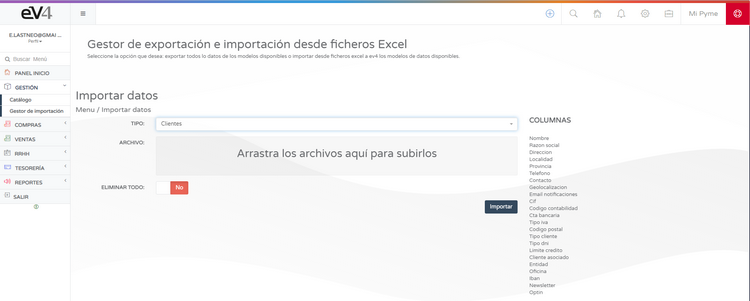

# Clientes

Para poder empezar a vender, necesitas tener clientes.  
**eV4ERP** trae configurado por defecto el **CLIENTE DE PASO**.  

## Añadir Clientes  

Puedes añadir clientes de manera manual desde la sección: **VENTAS → CLIENTES**. 

Si pulsamos sobre el botón **NUEVO**, se nos abrirá la ficha de cliente a completar.  

También podemos **importar/exportar** la cartera de clientes desde ficheros Excel con nuestro **GESTOR DE IMPORTACIÓN**.  

Recomendamos utilizar la plantilla que se aporta para un mayor control de los datos a importar.  
Cuando hayas creado o importado tu cartera de clientes, podrás empezar a crear y gestionar **pedidos, albaranes y ventas**.  

## Exportación de Clientes  

Puedes exportar tu cartera de clientes desde el **GESTOR DE EXPORTACIÓN**.  

Cuando hayas creado o importado tus clientes, podrás empezar a crear y gestionar **pedidos, albaranes y ventas**.  
