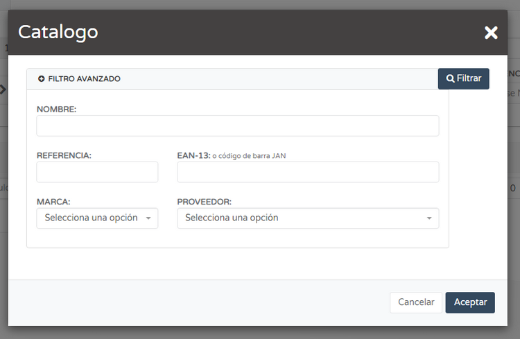

# TPV - Realizar el Primer Ticket  

Hemos hecho la primera venta. Ahora vamos a realizar el primer ticket.  

## Crear un Ticket  

La forma más rápida de crear un ticket es pulsar el botón **AÑADIR** (botón azul en la barra superior derecha) y posteriormente pulsar el botón **NUEVO TPV**. 

Pulsamos el botón **NUEVO TPV**, y nos aparecerá la pantalla para crear el ticket.  

## Completar el Ticket  

Debemos seleccionar:  
- **SERIE**  
- **CLIENTE**  
- **FECHA**  
- **VENDEDOR**  

## Añadir Productos al Ticket  

- **Por código de barras:**  
  - Si disponemos de un escáner, podemos leer el código de barras.  
  - Pulsamos sobre el campo **REFERENCIA CÓDIGO DE BARRAS**.  
  - Cuando el campo se ponga azul, escribimos manualmente la referencia o utilizamos el escáner.  

- **Por nombre del artículo:**  
  - Pulsamos sobre el campo **SELECCIONE UN ARTÍCULO**.  
  - Se abrirá un buscador donde podremos escribir su nombre.  
  - Debajo aparecerán todas las coincidencias.  

## Gestionar Líneas del Ticket  

- Para añadir una nueva línea, pulsamos el botón **+ NUEVA LÍNEA** en el centro de la pantalla o el botón azul con un **+** en la parte izquierda.  
- Para eliminar una línea, pulsamos el botón rojo con una **X** en su interior.  

### Buscador Avanzado  

El botón gris **Q+** abre un buscador avanzado que permite filtrar los artículos por:  
- **NOMBRE**  
- **REFERENCIA**  
- **EAN-13**  
- **MARCA**  
- **PROVEEDOR**  

## Aparcar y Recuperar Tickets  

- El botón rojo **APARCAR TICKET** permite **guardar un ticket** sin completar el pago.  
- Posteriormente, se puede recuperar tal y como fue “aparcado” para finalizar el cobro.  
- El botón **CANCELAR** descarta el ticket y nos devuelve al listado de tickets.  

Para recuperar un ticket aparcado, simplemente pulsamos sobre él, y se cargará en pantalla.  
> ⚠️ **Nota:** Un ticket aparcado se carga en el mismo estado en el que fue guardado, excepto la **serie**, que debe asignarse manualmente.  

Los dos últimos tickets del listado **no tienen serie asignada** porque son tickets aparcados.  

## Finalizar el Ticket  

1. Pulsamos **COBRAR Y FINALIZAR**.  
2. Se abrirá una ventana para seleccionar la **forma de pago** e **introducir el importe entregado**.  
3. Podemos marcar los números **0,00** con el ratón y eliminarlos para calcular el cambio.  
4. Para terminar la operación, pulsamos el botón **FINALIZAR**. 

## Listado de Tickets  

- El botón azul claro con **tres líneas horizontales** en la parte superior derecha nos lleva al **listado de tickets almacenados** en el sistema.  

- El botón rojo **TICKETS APARCADOS** muestra los tickets aparcados.  

Para recuperar un ticket “aparcado” solamente hay que pulsar sobre él y se nos cargará en pantalla.  

El ticket se carga en el mismo estado que estaba antes de ser “aparcado”, excepto un aspecto, la **serie**, que tendrá que ser asignada manualmente. Cuando “aparcamos” un ticket este se guarda sin serie asignada.  

Los dos últimos tickets del listado no tienen serie asignada, porque son tickets “aparcados”.  

✅ **Los tickets descuentan stock.**  
