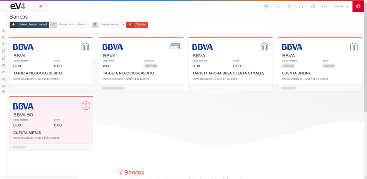
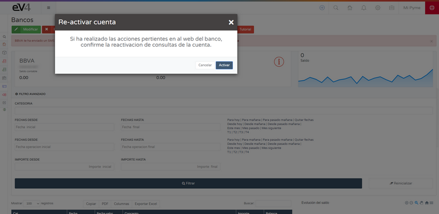
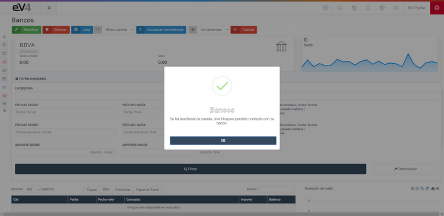

# CONECTA CON TU BANCO  

eV4 te permite conectar con tu banco para consultar tus movimientos bancarios. eV4 solo tiene acceso a sus datos bancarios en **modo lectura**, es decir, solo puede consultar dichos datos. **Nunca** podrá realizar operaciones financieras (pagos, transferencias, etc).  

Esta función se encuentra en el menú **TESORERÍA → BANCOS**.  

## Primera conexión  

La primera vez que accedamos veremos la siguiente pantalla.  

Pulsamos sobre el botón **CONECTA CON TU BANCO** y veremos la siguiente pantalla donde tendremos que seleccionar nuestra entidad bancaria.  

eV4 puede trabajar con más de **100 entidades bancarias de Europa y América**. Podemos filtrar las entidades bancarias por países, pulsando sobre él o bien buscarlas directamente por su nombre. Cuando la encontremos, pulsamos sobre ella.  

eV4 se adapta a la forma de trabajar de cada banco y te solicitará los datos requeridos por el mismo. 

Una vez introducidos los datos requeridos, pulsamos el botón **CONECTAR**.  

## Solicitud de movimientos bancarios  

La primera vez que eV4 se conecta con su banco, solicita los movimientos del **último año**.  

> ⚠️ Para solicitar los movimientos de **periodos superiores a 90 días**, según la normativa europea, su entidad bancaria le ha de facilitar un **código de control** que debe introducir a continuación. 

Pulsamos el botón **VALIDAR** y esperamos a que el proceso termine. Después nos aparecerán en pantalla las cuentas que tengamos en esta entidad bancaria.  

## Acciones sobre cuentas bancarias  

Si alguna de las cuentas tiene un **símbolo en color rojo** con una **"i" dentro de un círculo**, significa que se requiere que el usuario realice alguna acción. Si pulsamos sobre una cuenta, entramos en ella.  

Seguimos las instrucciones, en este caso pulsamos sobre el botón **HAGA CLICK PARA REACTIVAR CUENTA**.  

Y esperamos a que termine.  

**Continuar.**  
