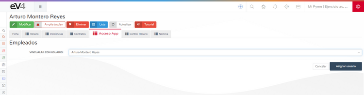

# CONTROL HORARIO  

Vamos a ver cómo configurar por primera vez el control horario.  

## 1. Activación del módulo  

En primer lugar, tenemos que pulsar sobre el **icono de herramientas (engranaje)** y seleccionar la opción: **CONFIGURAR MÓDULOS**. 

En la pantalla de **ACTIVACIÓN Y CONFIGURACIÓN DE MÓDULOS** tenemos el listado de módulos disponibles, desde aquí podremos acceder a su configuración.  

Seleccionamos el módulo **CONTROL HORARIO** y pulsamos el botón **CONFIGURAR**.  

Por defecto, el módulo está **desactivado**, para activarlo:  

1. Pulsamos en el recuadro blanco al lado de **NO**, y se pondrá en verde **SÍ**.  
2. Configuramos las opciones deseadas.  
3. Pulsamos el botón con un **icono de disco** en la parte derecha de la barra azul superior para guardar los cambios.  

Veremos un mensaje informándonos que **LOS PARÁMETROS SE HAN GUARDADO CORRECTAMENTE**. 

Pulsamos el botón con **icono de flecha** en la parte izquierda de la barra azul superior para volver a la pantalla de **ACTIVACIÓN Y CONFIGURACIÓN DE MÓDULOS**.  

## 2. Configuración del acceso a la aplicación móvil  

1. Pulsamos sobre el botón **CONFIGURAR** del módulo **ACCESO APP MOBILE**.  

2. Activamos la opción **ACTIVA ACCESO EV4APP** y dejamos el interruptor en **SÍ (verde)**. 

3. Pulsamos el **icono del disco** para guardar la configuración.  

Ahora hemos activado el **CONTROL HORARIO** en nuestro ERP y el acceso a la aplicación móvil para poder fichar.  

## 3. Asignación de usuarios a empleados  

Nos dirigimos a la sección **RRHH → EMPLEADOS** y seleccionamos un empleado.  

Ahora aparecen dos pestañas nuevas:  

- **Acceso App:** Para configurar el registro en la aplicación móvil.  
- **Control Horario:** Para consultar el historial y fichar desde el PC.  

Inicialmente, no hay ningún usuario asignado, por lo que debemos asignarlo manualmente.  

1. Seleccionamos el usuario del empleado.  

2. Pulsamos el botón **ASIGNAR USUARIO**.  

3. Pulsamos el botón **GENERAR ACCESO APP**.  

## 4. Métodos de acceso a la aplicación móvil  

### Opción 1: Código QR  

1. Pulsamos el botón **REGENERAR CÓDIGO DE ACCESO QR**.  
2. El usuario debe **escanear el código QR** en la aplicación móvil.  
3. Para enviar el código QR por correo, pulsamos el botón **ENVIAR EMAIL DE ACCESO QR**.  

### Opción 2: PinCode  

1. Pulsamos el botón **REGENERAR PINCODE DE ACCESO**.  
2. El usuario deberá introducir manualmente los siguientes datos en la aplicación móvil:  
   - **EvID**  
   - **PinCode**  
3. Para enviar los datos de acceso por correo, pulsamos el botón **ENVIAR EMAIL DE ACCESO**.  

## 5. Configuración del contrato laboral  

Para definir la jornada laboral del usuario, debemos crear un **contrato** donde se especifique la hora de inicio, la hora de salida y si es jornada continua o no.  

1. Nos dirigimos a la pestaña **CONTRATOS** dentro de la ficha del empleado.  

2. Pulsamos el botón **NUEVO**. 

3. Rellenamos los campos requeridos, especialmente:  
   - **Número de horas de la jornada**  
   - **Si es jornada continua o no**  
   - **Hora de comienzo y finalización de la jornada laboral**  
4. Pulsamos el botón **GRABAR**.  

Una vez asignados los usuarios y completado un contrato, los empleados ya pueden fichar.  

## 6. Registro de jornada laboral  

Para fichar desde el PC, vamos a la sección **RRHH → CONTROL HORARIO**.

- **Para iniciar la jornada laboral**, pulsamos el botón verde **COMENZAR JORNADA**.  

- **Para finalizar la jornada laboral**, pulsamos el botón rojo **FINALIZAR JORNADA**.  
