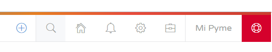
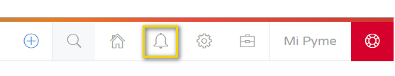

#### Bienvenido a eV4ERP, hacemos sencillo lo complejo

Nuestro software te permitirá gestionar tu negocio de una forma más eficiente. Vamos a conocer de manera rápida la interface de eV4ERP.

eV4ERP dispone de dos barras de herramientas.

#### 1. BARRA SUPERIOR DERECHA

En la parte superior derecha de la pantalla tenemos la barra de acceso rápido:

En esta tenemos disponibles ocho botones de acceso rápido a diferentes funciones que podemos ejecutar con un solo clic, ganando así rapidez a la hora de trabajar. Estos botones son de izquierda a derecha:

- **Ꚛ**: El botón más nos permite crear un nuevo cliente, una nueva factura de venta, un nuevo ticket, un nuevo proveedor, una nueva factura de compra o acceder a los reportes con un solo clic.

  
- **BUSCAR**: El botón con el símbolo de una lupa nos permite buscar (artículos, clientes, proveedores, etc.) en la base de datos de eV4ERP. 

Al pulsar sobre él se nos abrirá una ventana donde podremos introducir los términos de búsqueda y debajo se nos mostrarán los resultados.

- **PANEL DE INICIO**: El botón con el símbolo de una casa nos llevará directamente al panel de inicio.

- **NOTIFICACIONES**: El botón con el símbolo de una campana nos abre un panel desplegable con las notificaciones que tengamos en el sistema.

- **CONFIGURACION**: El botón con el símbolo de un engranaje nos da acceso a 7 opciones para configurar eV4ERP.

- **HERRAMIENTAS**: El botón con el símbolo de un maletín nos da acceso a 4 herramientas:  
  - Sincronización con PrestaShop (en caso de estar contratado)
  - Descargar Anydesk (Software de gestión remota)
  - Ver tickets e incidencias
  - Invitaciones

- **EMPRESA**: El botón con el nombre de la empresa nos da acceso a configurar o modificar los datos de la empresa.

- **SOPORTE**: El último botón rojo nos permite enviar un ticket de asistencia al departamento de soporte.

#### 2. COLUMNA IZQUIERDA

En la columna de la izquierda tenemos el menú que nos da acceso a todas las funciones de eV4ERP. Este panel puede ser desplegado/ocultado a voluntad pulsando el botón con las tres líneas horizontales.

- **BUSCADOR**: En este panel tenemos un buscador que nos permite buscar diferentes secciones del menú directamente escribiendo su nombre.

- **PANEL INICIO**: Este botón nos llevará al panel de inicio desde cualquier sección de la aplicación.

A continuación dispondremos de todas las funcionalidades contratadas, en este ejemplo:

- **GESTIÓN**: Podemos gestionar el catálogo.
- **COMPRAS**: Podemos gestionar los proveedores, albaranes y compras.
- **VENTAS**: Podemos gestionar los clientes, pedidos, albaranes, presupuestos y facturas.
- **RRHH**: Podemos gestionar empleados, centros de trabajo y nóminas.
- **TESORERÍA**: Podemos gestionar los arqueos de caja y las cuentas bancarias.
- **REPORTES**: Podemos consultar los diferentes reportes.
- **SALIR**: Este botón nos permite abandonar la aplicación.