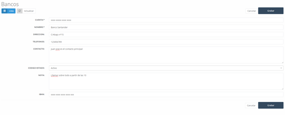

#### Bancos

En este apartado encontramos la lista (ver Imagen 25: Listado de bancos) de los distintos bancos con los que la empresa trabaja, ya sea para gestión de las cuentas de la empresa u otras gestiones que esta requiera.

##### 5.4.1 Bancos – Nuevo

Podemos agregar al listado de bancos uno nuevo, debemos pulsar sobre el botón **Nuevo** y rellenar el formulario (ver Imagen 26: Nuevo banco) que nos aparecerá con los siguientes campos:

- **Cuenta**: Número de la cuenta bancaria.
- **Entidad**: Código de la entidad bancaria.
- **Oficina**: Código de la oficina.
- **DC**: Número de cuenta.
- **Nombre**: Nombre del banco.
- **Dirección**: Dirección de la sucursal.
- **Teléfonos**: Teléfono de contacto del banco.
- **Contacto**: Nombre de la persona de contacto.
- **Código estado**: Estado del banco en el sistema.
- **Nota**: Nota informativa sobre el banco.
- **IBAN**: IBAN del banco introducido.

#### Descuentos

Al acceder a descuentos, en la pantalla principal nos encontramos un listado de los descuentos (ver Imagen 27: Descuentos) que existen en el sistema y que posteriormente cada cliente podrá tener asociado. Además, pueden tener asociado un rango de fecha en el que será válido para ser aplicado en un producto o catálogo concreto.

