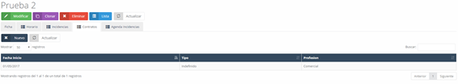
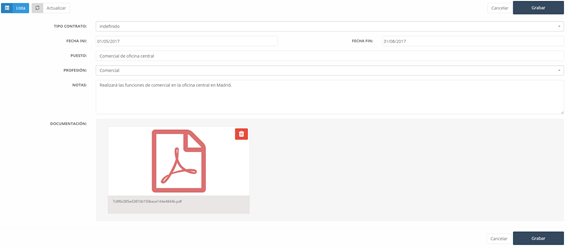

#### Contratos

En la pestaña contratos, encontramos los contratos realizados a un empleado a lo largo de su vida laboral en la empresa.

#### Contactos

Para añadir un nuevo contrato, debemos pulsar sobre el botón nuevo, lo que nos llevará a una nueva pantalla con un formulario a cumplimentar con los siguientes campos:

- **Tipo de contrato:** Tipo de contrato del empleado.

- **Fecha de inicio:** Fecha de inicio del contrato.

- **Fecha de fin:** Fecha de finalización del contrato.

- **Puesto:** Puesto  de trabajo ejercido por el empleado.

- **Profesión:** Profesión que ejercida por el empleado.

- **Notas:** Cualquier nota aclarativa sobre el trabajo.

- **Documentación:** Permite subir PDF o imágenes, como pueden ser el contrato o cualquier documento asociado a este.

