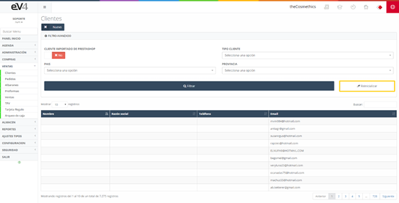
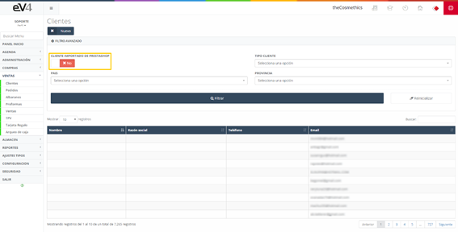
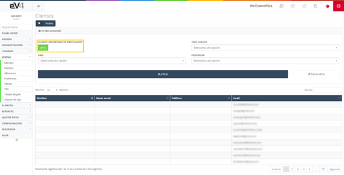
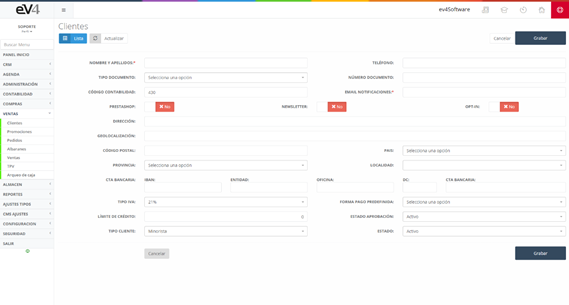
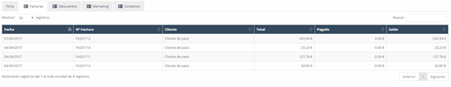

#### Clientes

Listado de los clientes existentes de la empresa, junto con listados de sus facturas, descuentos y contactos.

#### CLIENTES - Vista Inicial

Esta es la vista inicial de la sección **“CLIENTES”**, inicialmente los campos de búsqueda están por defecto en blanco. Cuando realicemos una búsqueda, los campos conservarán los valores introducidos en esta, por si es necesario volver a repetir una búsqueda relacionada con estos datos.

Si queremos restablecer el estado inicial de la plantilla y borrar los datos de la última búsqueda, podemos hacerlo pulsando el botón **“Reinicializar”**.

Hay que prestar atención a otro botón disponible: **“CLIENTE IMPORTADO DE PRESTASHOP”**.

#### Posiciones del Botón

Este botón tiene dos posiciones:

- **NO**: Nos muestra todos los clientes disponibles, los clientes registrados en ev4ERP y los clientes importados desde Prestashop.
- **SI**: Nos muestra solamente los clientes importados desde Prestashop.

Para crear un nuevo cliente introducimos todos sus datos personales como son el nombre, número de documento, localidad, etc., además de su cuenta bancaria, forma de pago que el cliente quiere como predefinida, un límite de crédito máximo de gastos y el tipo de cliente del que se trata.

#### Facturas

Se trata de un listado de facturas expedidas al cliente que estamos visualizando. Estas son meramente visuales y solo tendrás acceso para modificarlas desde la respectiva funcionalidad dentro de la aplicación.

