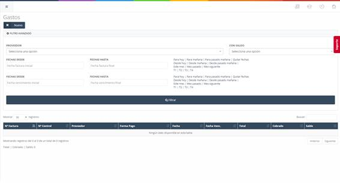
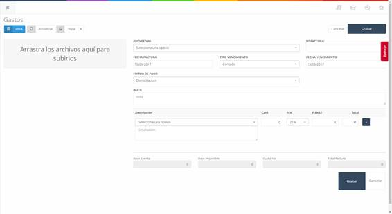

# Gastos

En este apartado se recogen los gastos referentes a la empresa, como puedan ser agua, luz, etc.

En la pantalla inicial (**ver Imagen 14: Administración - Gastos - Lista de gastos**) de este apartado, encontramos el listado de las facturas referentes a los gastos introducidos en el sistema, así como unos filtros de búsqueda y un botón que permite añadir un nuevo gasto (**Botón "Nuevo"**).

## Gastos – Nuevo

Para crear un nuevo gasto, debemos pulsar sobre el botón **"Nuevo"** en la pantalla inicial de gastos (**ver Imagen 14: Administración - Gastos - Lista de gastos**). Esto nos llevará a una nueva pantalla (**ver Imagen 15: Administración - Gastos – Nuevo**) en la que podremos añadir el nuevo gasto al sistema.

### Añadir un Gasto  

Para añadir el gasto al sistema, debemos rellenar los campos del formulario y pulsar el botón **"Grabar"**.  

- **Proveedor**: Proveedor del artículo o gasto.  
- **Nº Factura**: Número asignado a la factura para identificarla.  
- **Fecha factura**: Fecha de emisión de la factura.  
- **Tipo vencimiento**: Forma de pago de la factura.  
- **Fecha vencimiento**: Fecha de vencimiento de la factura.  
- **Nota**: Información adicional en caso de ser requerida.  
- **Descripción**: Nombre del artículo o gasto.  
- **Cant**: Cantidad de artículos de un producto o gasto.  
- **IVA**: I.V.A. correspondiente a un gasto o producto.  
- **P. Base**: Precio base de un gasto o producto.  
- **Total**: Precio total de un gasto o producto.  