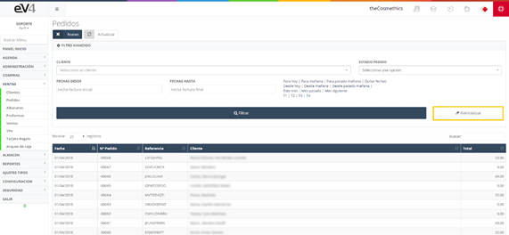
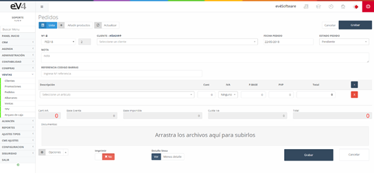
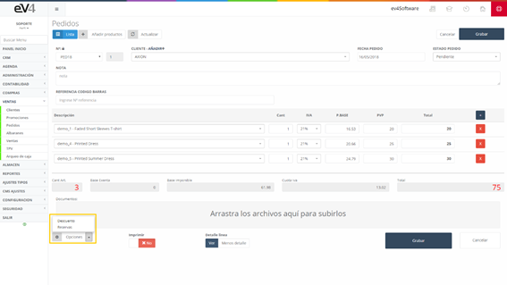
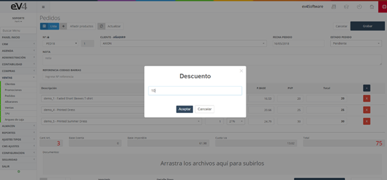
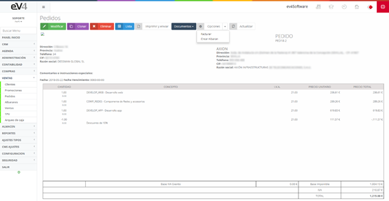
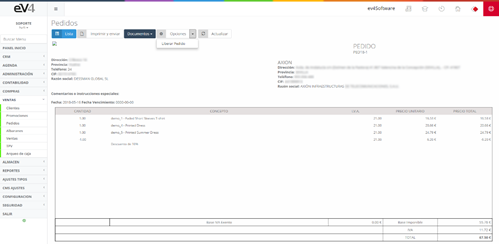

#### Pedidos

Este apartado contiene todos los pedidos realizados por los distintos clientes a nuestra empresa.  

Lo primero que vemos al entrar es el listado de todos los pedidos realizados y un filtro que facilita la búsqueda de estos, permitiendo filtrar por **fechas, cliente o estado del pedido**. 

#### Vista Inicial de la Sección "PEDIDOS"

Esta es la vista inicial de la sección **"PEDIDOS"**. Inicialmente, los campos de búsqueda están por defecto en blanco. Cuando realicemos una búsqueda, los campos conservarán los valores introducidos en esta, por si es necesario volver a repetir una búsqueda relacionada con estos datos.  

Si queremos restablecer el estado inicial de la plantilla y borrar los datos de la última búsqueda, podemos hacerlo pulsando el botón **"Reinicializar"**.  

Al crear un nuevo pedido, el funcionamiento es exactamente el mismo que en **pedidos de compras**, con la diferencia de que, en lugar de seleccionar a un proveedor, esta vez seleccionamos al **cliente** que realiza el pedido. 

#### Descuento en Pedidos  

En el desplegable **"Opciones"**, podremos seleccionar la función **"Descuento"**, que mostrará una ventana emergente en la que podremos introducir un porcentaje que será aplicado en forma de descuento sobre el total. 

Nos mostrará la siguiente ventana:

#### Impresión y Gestión de Pedidos  

Si seleccionamos la opción de **imprimir** un pedido, aparecerá una ventana similar a la de **pedidos de compras**, permitiéndonos **imprimirlo** y enviarlo por **e-mail**.  

Al igual que en **pedidos de compras**, este apartado mantiene el mismo funcionamiento y tipo de vista. Podemos:  

- **Crear el albarán** a partir del pedido generado.  
- **Rectificar** el pedido.  
- **Imprimirlo y enviarlo por e-mail**.  
- Consultar un **listado de los documentos adjuntos**.  

#### Vista General de un Pedido  

Veamos cómo sería la vista general de un pedido:  

#### Estado del Pedido una vez Contabilizado  

Una vez que el pedido haya sido **contabilizado** por el sistema y se haya **descontado el stock**, el pedido queda **bloqueado** y ya no es posible su modificación.

Una vez que el pedido haya sido **contabilizado** por el sistema y se haya **descontado el stock**, el pedido queda **bloqueado** y ya no es posible su modificación.