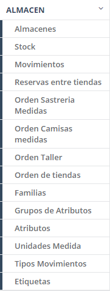
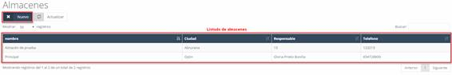
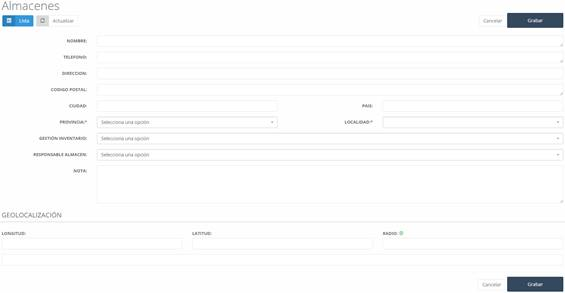

#### ALMACÉN

En este apartado del sistema, encontramos las funcionalidades de la empresa asociadas a **almacenes** (**ver Imagen 75: Almacén – Menú**), como es el **catálogo**, los **movimientos** y **familia**, entre otros.

Dentro de este apartado encontramos los diferentes almacenes que tenemos (ver Imagen 76: Almacén - Almacenes – Listado).

#### Almacenes – Nuevo

Para crear un nuevo **almacén** o **centro**, debemos pulsar el botón **Nuevo** en la pantalla inicial de **almacenes** (**ver Imagen 76: Almacén - Almacenes – Listado**). Al pulsar sobre el botón, nos aparecerá una pantalla con un formulario a rellenar con la información del almacén (**ver Imagen 77: Almacén - Almacenes – Nuevo**).

#### Campos a Rellenar para Crear un Almacén

Los campos a rellenar son:

- **Nombre**: Nombre del almacén o centro.  
- **Teléfono**: Teléfono del almacén o centro.  
- **Dirección**: Dirección del almacén o centro.  
- **Código postal**: Código postal de la localidad en la que se encuentra el almacén o centro.  
- **Ciudad**: Ciudad en la que está ubicado el almacén o centro.  
- **País**: País en la que está ubicado el almacén o centro.  
- **Provincia**: Provincia en la que está ubicado el almacén o centro.  
- **Localidad**: Localidad en la que se encuentra ubicado el almacén o centro.  
- **Gestión Inventario**: Método a utilizar para realizar la gestión del inventario.  
- **Responsable almacén**: Persona responsable del almacén o centro.  
- **Nota**: Nota informativa sobre el almacén o centro.  
- **Geolocalización**: Se corresponde con las coordenadas geográficas del centro.

Una vez hayamos completado los campos, debemos pulsar sobre el botón **Grabar** para que el nuevo almacén quede grabado en el sistema.