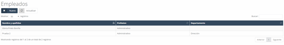
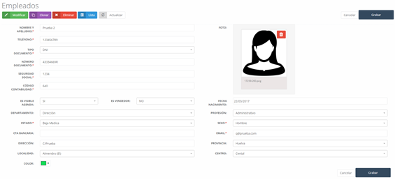

#### Empleados

Al acceder a empleados lo primero que vemos en pantalla, es un listado de los empleados (ver Imagen 16: Empleados) introducidos en el sistema (inicialmente se encuentra vacío).

#### Empleados – Nuevo

Para agregar un nuevo **empleado**, tan sólo tenemos que pulsar sobre el botón **Nuevo** en la pantalla inicial de **empleados** (**ver Imagen 16: Empleados**) y nos aparecerá el formulario a cumplimentar con los datos del empleado (**ver Imagen 18: Horarios empleados**). Los datos a cumplimentar son los siguientes:

- **Nombre y apellidos**: Nombre y apellidos del empleado.  
- **Teléfono**: Teléfono del empleado (fijo o móvil).  
- **Tipo de documento**: Tipo de documento de identificación personal.  
- **Número de documento**: Número de identificación del tipo de documento seleccionado.  
- **Seguridad social**: Número de la seguridad social del empleado.  
- **Código contabilidad**: Código para tesorería.  
- **Es visible agenda**: Activa o desactiva el empleado en la agenda, es decir, permite que el usuario aparezca o no en esta.  
- **Es vendedor**: Indica si el empleado es vendedor en la empresa.  
- **Fecha de nacimiento**: Fecha de nacimiento del empleado.  
- **Departamento**: Departamento al que pertenece actualmente.  
- **Profesión**: Profesión que ejerce actualmente.  
- **Estado**: Estado actual del empleado (trabajando, baja, vacaciones, etc.).  
- **Sexo**: Sexo del empleado.  
- **CTA. Bancaria**: Cuenta bancaria del empleado.  
- **Email**: Correo electrónico del empleado.  
- **Dirección**: Lugar de residencia del empleado.  
- **Provincia**: Provincia donde reside el empleado.  
- **Localidad**: Localidad en la que reside el empleado.  
- **Centro**: Centro de trabajo al que pertenece el empleado.  
- **Color**: Color de filtro para la agenda.  
- **Foto del empleado**: Podemos agregar una nueva foto al empleado arrastrando o clicando sobre la caja correspondiente.

