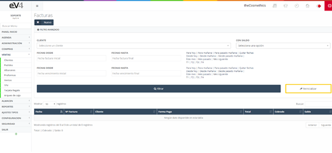
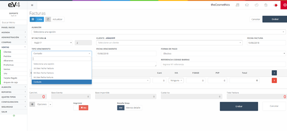

# Ventas

Son las ventas generadas a la hora de la compra de los productos de nuestra empresa. Al entrar por primera vez, vemos el listado de todas las ventas generadas, además de un pequeño filtro para la búsqueda de estas.

## Vista Inicial de la Sección "FACTURAS"

Esta es la vista inicial de la sección **"FACTURAS"**, inicialmente los campos de búsqueda están por defecto en blanco. Cuando realicemos una búsqueda, los campos conservarán los valores introducidos, por si es necesario volver a repetir una búsqueda relacionada con estos datos.

Si queremos restablecer el estado inicial de la plantilla y borrar los datos de la última búsqueda, podemos hacerlo pulsando el botón **"Reinicializar"**.

## Facturas Nuevo

Vista inicial de la plantilla **"FACTURAS"**.

### Crear una Nueva Venta

Para crear una nueva venta, seleccionamos el **ALMACÉN**, la **serie de la factura** en el campo **"Nº FACTURA"**, el **CLIENTE** al que se la realizamos, además de la **fecha de emisión** de la factura en el campo **"FECHA FACTURA"**.

El campo **"TIPO DE VENCIMIENTO"** nos permite seleccionar el tipo de vencimiento: **al contado**, o a **30**, **60** o **90 días**.

El campo **"FECHA DE VENCIMIENTO"** nos permite asignar la fecha de vencimiento de la factura.

En la foto observamos el campo **"FORMA DE PAGO"**, que al pulsar sobre él nos permite seleccionar el **método de pago** de la factura.

Para introducir el catálogo de una manera más rápida, podemos hacerlo ingresando el **código de barras** del producto mediante un lector de código de barras. Esto nos traerá el producto y sus datos. Además, si pulsamos sobre el botón **"DETALLE LÍNEA"**, nos dará la opción de introducir algún detalle más al producto.

Para **imprimir la factura** y enviarla, el proceso a realizar es el mismo que el seguido en los apartados anteriores.

En el formulario de nueva **"VENTA/FACTURA"** podemos encontrar un botón **"Albaranes"** dentro del menú desplegable **"Opciones"**.

Al pulsarlo, aparecerá una ventana emergente con los **albaranes** asignados al **cliente** seleccionado en el formulario. Allí seleccionamos los albaranes que deseamos importar y pulsamos **aceptar**. De esta forma, se importan todas las líneas de los albaranes seleccionados en nuestra **factura** de forma automática.

Otra funcionalidad dentro del menú desplegable de opciones es la de introducir un **descuento**. Cuando pulsamos esa opción, aparecerá una ventana emergente para introducir un porcentaje que será descontado del precio total.

Por último, existe la posibilidad de acceder a la **agenda** desde la propia pantalla de nueva factura, pudiendo de esta forma concertar una cita con el cliente.

Una vez generada la factura, la vista sería la mostrada en la siguiente imagen, con el añadido de un nuevo botón **"Cobrar factura"**.

Para **cobrar la factura**, pulsamos sobre el nuevo botón y se desplegará una ventana como la siguiente:

En la **Imagen: Cobrar factura**, vemos dos pestañas: 

- **Cobro**: Donde introduciremos los datos de la forma de pago de la factura por parte del cliente.
- **Movimientos**: Incluye un listado de los pagos de esa factura.